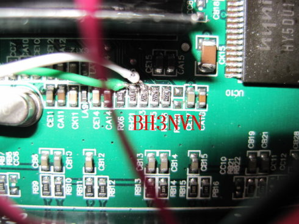
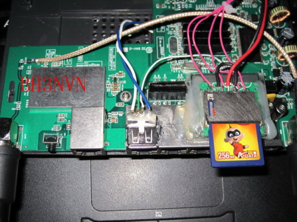
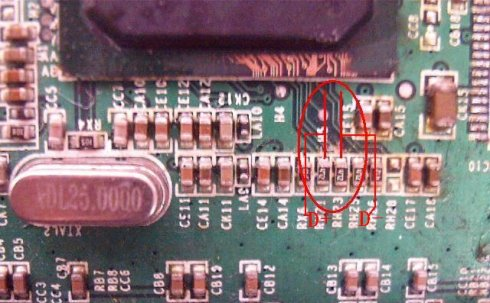

1.dd-wrt.com下载固件包及源码包

2.编译添加或者配置usb存储支持

3.按接口图添加usb

[http://www.home-wifi.com/forum.php?mod=viewthread&page=1&tid=3962](http://www.home-wifi.com/forum.php?mod=viewthread&page=1&tid=3962)

> 注意焊点位置，两个数据线左边D+，右边D-，下边的472是4.7k的下拉电阻，右边两个电阻是另一组USB口。所以直接引线就可以，但是我的优盘经常不能识别，就又在USB座上把两条数据线对地接了10k的下拉电阻，相当于和图上的472并起来，现在使用很正常。 
> 
> 使用5V 3A电源给路由器供电，不用安装7805了，电源线直接接到电源插座
> 
> 
> 
> 
