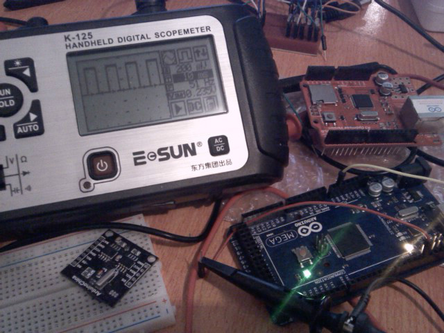

DigitalWrite(pin,HIGH);
DELAY(10);
DigitalWrite(pin,LOW)
DELAY(10);

观察波形（上升沿触发）频率是51Hz，峰值为0.520V（使用外接电源的情况下，USB作电源为0.505V）。 除掉市电滤波的原因，应该是128本身Timer造成的问题，因DELAY使用的是Timer，选中的端口同样为Timer可用的端口，故在电平维持时可看到波形有毛刺（示波器太烂了吧）。 
