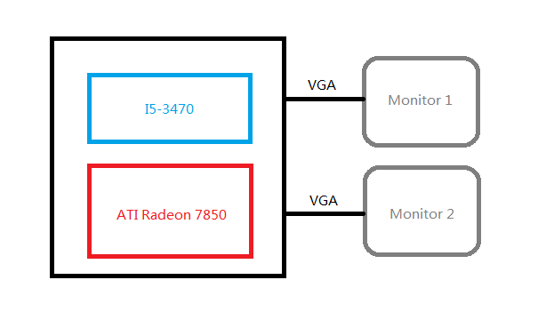

To inspire you, I've got a video from someone else. Better mutt the volume by the way. [Arch Linux KVM Crysis HD Gpu Passthrough](http://www.youtube.com/watch?v=Qi1LdFkRzIs "Arch Linux KVM Crysis HD Gpu Passthrough") Or you can download it to see. [Download the video in HD](http://blog.lofyer.org/wp-content/uploads/Arch-Linux-KVM-Crysis-HD.flv "Download the video") 

Here's the links I refer to: [http://thread.gmane.org/gmane.comp.emulators.kvm.devel/71981](http://thread.gmane.org/gmane.comp.emulators.kvm.devel/71981 "http://thread.gmane.org/gmane.comp.emulators.kvm.devel/71981") [https://bbs.archlinux.org/viewtopic.php?id=162768](https://bbs.archlinux.org/viewtopic.php?id=162768 "https://bbs.archlinux.org/viewtopic.php?id=162768") [https://docs.google.com/document/d/1ef\_nfl652L0HLn\_wGvnpgjsBJd9LZzaV\_-rIcEEoK8Y/edit?pli=1](https://docs.google.com/document/d/1ef_nfl652L0HLn_wGvnpgjsBJd9LZzaV_-rIcEEoK8Y/edit?pli=1 "https://docs.google.com/document/d/1ef_nfl652L0HLn_wGvnpgjsBJd9LZzaV_-rIcEEoK8Y/edit?pli=1") [http://www.linux-kvm.org/page/VGA\_device\_assignment](http://www.linux-kvm.org/page/VGA_device_assignment "http://www.linux-kvm.org/page/VGA_device_assignment") [http://www.linux-kvm.org/page/How\_to\_assign\_devices\_with\_VT-d\_in\_KVM](http://www.linux-kvm.org/page/VGA_device_assignment "http://www.linux-kvm.org/page/VGA_device_assignment")

## Result: VGAPassthrough: success in host F19, guest Windows7 GPUPassthrough: success in Fedora-Rawhide

HOST: CPU: Core i5 3470 GPU: ATI HD Radeon 7850 OS: Fedora-Rawhide QEMU: qemu-1.5.1  So, here's the steps

## 0\. Enable the mainboard VxT, iommu and alter the video device to Intel HD

## 1\. See what we have got now.

lspci;lspci -n

We have output below

...
01:00.0 VGA compatible controller: Advanced Micro Devices, Inc. \[AMD/ATI\] Pitcairn PRO \[Radeon HD 7850\]
01:00.1 Audio device: Advanced Micro Devices, Inc. \[AMD/ATI\] Cape Verde/Pitcairn HDMI Audio \[Radeon HD 7700/7800 Series\]
...

...
01:00.0 0300: 1002:6819
01:00.1 0403: 1002:aab0
...

You can see the pci bus and vendor.

## 2\. Modify the kernel parameter, morprobe.d and libvirt.conf

Add follow parameters to grub.conf

intel\_iommu=on pci-stub.ids=1002:6819,1002:aab0,vfio\_iommu\_type1.allow\_unsafe\_interrupts=1

NOTE: If you have got an AMD cpu, please replace "interl\_iommu=on" with "iommu=pt iommu=1" Add modprobe.conf to /etc/modprobe.d/ with this content:

blacklist radeon
options kvm ignore\_msrs=1
options kvm allow\_unsafe\_interrupts=1
options kvm-amd npt=0
options kvm\_intel emulate\_invalid\_guest\_state=0
options vfio\_iommu\_type1 allow\_unsafe\_interrupts=1

change the following options in /etc/libvirt/qemu.conf:

\# The user ID for QEMU processes run by the system instance.
user = "root"

# The group ID for QEMU processes run by the system instance.
group = "root"

......

# If clear\_emulator\_capabilities is enabled, libvirt will drop all
# privileged capabilities of the QEmu/KVM emulator. This is enabled by
# default.
#
# Warning: Disabling this option means that a compromised guest can
# exploit the privileges and possibly do damage to the host.
#
clear\_emulator\_capabilities = 0

Reboot.

## 3\. Using scripts below

### Version 1: VFIO-Passthrough

File: vfio-bind

#!/bin/bash
modprobe vfio-pci
for var in "$@"; do
        for dev in $(ls /sys/bus/pci/devices/$var/iommu\_group/devices); do
                vendor=$(cat /sys/bus/pci/devices/$dev/vendor)
                device=$(cat /sys/bus/pci/devices/$dev/device)
                if \[ -e /sys/bus/pci/devices/$dev/driver \]; then
                        echo $dev > /sys/bus/pci/devices/$dev/driver/unbind
                        fi
                echo $vendor $device > /sys/bus/pci/drivers/vfio-pci/new\_id
        done
done

Bind the device

./vfio-bind 0000:01:00.0 0000:01:00.1

Start VM

#!/bin/bash
sudo modprobe vfio-pci

sudo qemu-system-x86\_64 -no-user-config -nodefaults -m 2048M -smp 4 -boot menu=on \\
-net nic -net user -enable-kvm -monitor stdio -vga qxl -global qxl-vga.vram\_size=67108864 \\
-spice port=6000,ipv4,disable-ticketing \\
-device intel-hda,id=sound0,bus=pcie.0,addr=0x4 -device hda-duplex,id=sound0-codec0,bus=sound0.0,cad=0 \\
-drive file=Windows7.iso,if=none,id=drive-ide0-1-0,readonly=on,format=raw -device ide-cd,bus=ide.1,unit=0,drive=drive-ide0-1-0,id=ide0-1-0 \\
-drive file=/home/lofyer/gpu\_passthrough/f17.qcow2,if=none,id=drive-virtio-disk0,format=qcow2,cache=none,werror=stop,rerror=stop,aio=threads -device virtio-blk-pci,scsi=off,bus=pcie.0,addr=0x7,drive=drive-virtio-disk0,id=virtio-disk0,bootindex=1 \\
-device virtio-balloon-pci,id=balloon0,bus=pcie.0,addr=0x8 \\
-M q35 \\
-device piix4-ide,bus=pcie.0 \\
-device ioh3420,bus=pcie.0,addr=1c.0,multifunction=on,port=1,chassis=1,id=root.1 \\
-device vfio-pci,host=01:00.0,bus=root.1,addr=00.0,multifunction=on,x-vga=on \\
-device vfio-pci,host=01:00.1,bus=root.1,addr=00.1 \\
-fda virtio.vfd

### Version 2: PCI-Passthrough

Bind device

#!/bin/bash
modprobe pci-stub
for id in 6819 aab0; do
    echo 1002 $id > /sys/bus/pci/drivers/pci-stub/new\_id
done
for pci in 0000:01:00.{0,1}; do
    echo $pci > "/sys/bus/pci/devices/$pci/driver/unbind"
    echo $pci > /sys/bus/pci/drivers/pci-stub/bind
done

Start VM

#!/bin/bash
qemu-system-x86\_64 \\
-hda ../f17.qcow2 \\
-cdrom /run/media/lofyer/Cache/OS\_ISO/cn\_windows\_7\_ultimate\_with\_sp1\_x64\_dvd\_u\_677408.iso \\
-m 2048 -balloon virtio -smp 4 -enable-kvm \\
-device pci-assign,host=01:00.0
