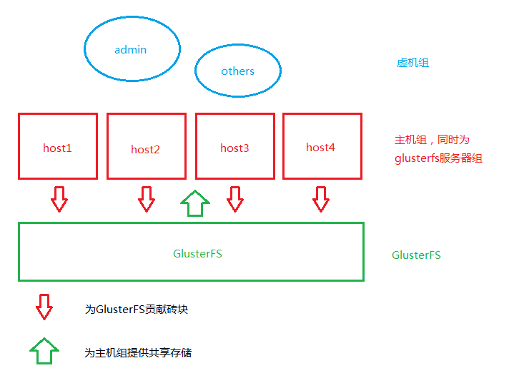

笔者写此文时oVirt已经更新到3.4。

在此，我们会用到之前创建的distributed-replicate存储，这样可用保证系统服务的高度可用性有所提高。

有以下几点需要注意：

> 1\. 宿主机的CPU架构需要为Westmere（Westmere E56xx/L56xx/X56xx）、Nehalem（Intel Core i7 9xx）、Penryn（Intel Core 2 Duo P9xxx）或者Conroe（Intel Celeron\_4x0）中的之一，否则集群类型会与宿主机类型不兼容导致数据中心启动失败。
> 
> CPU Family table 参阅 [Intel Architecture and Processor Identification With CPUID Model and Family Numbers](https://software.intel.com/en-us/articles/intel-architecture-and-processor-identification-with-cpuid-model-and-family-numbers "cpu family table")
> 
> 2\. 建议参考第11节提前安装含有oVirt管理的虚拟机，硬盘格式为RAW，从而在安装管理机时作为OVF导入或者覆盖虚拟磁盘，减少失败风险时间。

## 准备

**每台机器上都要添加作为虚拟机运行的engine的FQDN，此处为ha.lofyer.org。**

\# echo -e '192.168.10.100\\tha.lofyer.org' >> /etc/hosts

**存储可以使用之前的glusterfs，方式为NFS\_V3，注意将brick的权限设置为vdsm.kvm或者36:36。**

\# gluster volume create gluster-vol1 replica 2 gs1.example.com:/gluster\_brick0 gs2.example.com:/gluster\_brick0 gs3.example.com:/gluster\_brick0 gs4.example.com:/gluster\_brick0 gs1.example.com:/gluster\_brick1 gs2.example.com:/gluster\_brick1 gs3.example.com:/gluster\_brick1 gs4.example.com:/gluster\_brick1 force

**由于engine以及node的网络服务依赖于network而非NetworkManager，我们需要启用前者禁用后者，在每一台服务器上都进行如下类似配置修改网络。**

NAME=eth0
DEVICE=eth0
ONBOOT=yes
BOOTPROTO=static
# 注意修改此处的IP
IPADDR=192.168.10.101
NETMASK=255.255.255.0
GATEWAY=192.168.10.1
DNS1=192.168.10.1

\# chkconfig NetworkManager off
# chkconfig network on
# service NetworkManager stop; service network restart

## 添加repo

\# yum localinstall http://resources.ovirt.org/releases/ovirt-release.noarch.rpm
# yum install ovirt-hosted-engine-setup

或者手动添加：

\[ovirt-stable\]
name=Latest oVirt Releases
baseurl=http://ovirt.org/releases/stable/rpm/EL/$releasever/
enabled=1
skip\_if\_unavailable=1
gpgcheck=0

\[ovirt-3.4-stable\]
name=Latest oVirt 3.4.z Releases
baseurl=http://ovirt.org/releases/3.4/rpm/EL/$releasever/
enabled=1
skip\_if\_unavailable=1
gpgcheck=0

\[epel\]
name=Extra Packages for Enterprise Linux 6 - $basearch
#baseurl=http://download.fedoraproject.org/pub/epel/6/$basearch
mirrorlist=https://mirrors.fedoraproject.org/metalink?repo=epel-6&arch=$basearch
failovermethod=priority
enabled=1
includepkgs=epel-release,python-uinput,puppet,python-lockfile,python-cpopen,python-ordereddict,python-pthreading,python-inotify,python-argparse,novnc,python-ply,python-kitchen,python-daemon,python-websockify,livecd-tools,spice-html5,mom
gpgcheck=0

\[ovirt-glusterfs-epel\]
name=GlusterFS is a clustered file-system capable of scaling to several petabytes.
baseurl=http://download.gluster.org/pub/gluster/glusterfs/LATEST/EPEL.repo/epel-$releasever/$basearch/
enabled=1
skip\_if\_unavailable=1
gpgcheck=0

\[ovirt-glusterfs-noarch-epel\]
name=GlusterFS is a clustered file-system capable of scaling to several petabytes.
baseurl=http://download.gluster.org/pub/gluster/glusterfs/LATEST/EPEL.repo/epel-$releasever/noarch
enabled=1
skip\_if\_unavailable=1
gpgcheck=0

## 安装hosted-engine

\# yum install ovirt-hosted-engine-setup

回答一些列问题，如下所示：

\# hosted-engine --deploy
\[ INFO  \] Stage: Initializing
          Continuing will configure this host for serving as hypervisor and create a VM where you have to install oVirt Engine afterwards.
          Are you sure you want to continue? (Yes, No)\[Yes\]: yes
\[ INFO  \] Generating a temporary VNC password.
\[ INFO  \] Stage: Environment setup
          Configuration files: \[\]
          Log file: /var/log/ovirt-hosted-engine-setup/ovirt-hosted-engine-setup-20140508182241.log
          Version: otopi-1.2.0 (otopi-1.2.0-1.el6)
\[ INFO  \] Hardware supports virtualization
\[ INFO  \] Bridge ovirtmgmt already created
\[ INFO  \] Stage: Environment packages setup
\[ INFO  \] Stage: Programs detection
\[ INFO  \] Stage: Environment setup
\[ INFO  \] Stage: Environment customization
         
          --== STORAGE CONFIGURATION ==--
         
          During customization use CTRL-D to abort.
          Please specify the storage you would like to use (nfs3, nfs4)\[nfs3\]: 
# 此处的存储域只存储hosted-engine的相关文件，不作为主数据域
          Please specify the full shared storage connection path to use (example: host:/path): 192.168.10.101:/gluster-vol1/ovirt\_data/hosted\_engine
\[ INFO  \] Installing on first host
          Please provide storage domain name. \[hosted\_storage\]: 
          Local storage datacenter name is an internal name and currently will not be shown in engine's admin UI.Please enter local datacenter name \[hosted\_datacenter\]: 
         
          --== SYSTEM CONFIGURATION ==--
         
         
          --== NETWORK CONFIGURATION ==--
         
          iptables was detected on your computer, do you wish setup to configure it? (Yes, No)\[Yes\]: no
          Please indicate a pingable gateway IP address \[192.168.10.1\]: 
         
          --== VM CONFIGURATION ==--
# 虚拟engine的安装方式         
          Please specify the device to boot the VM from (cdrom, disk, pxe) \[cdrom\]: 
          The following CPU types are supported by this host:
          	 - model\_Conroe: Intel Conroe Family
          Please specify the CPU type to be used by the VM \[model\_Conroe\]: 
          Please specify path to installation media you would like to use \[None\]: /tmp/centos.iso
          Please specify the number of virtual CPUs for the VM \[Defaults to minimum requirement: 2\]: 
          Please specify the disk size of the VM in GB \[Defaults to minimum requirement: 25\]: 
          You may specify a MAC address for the VM or accept a randomly generated default \[00:16:3e:59:9b:e2\]: 
          Please specify the memory size of the VM in MB \[Defaults to minimum requirement: 4096\]: 4096
          Please specify the console type you would like to use to connect to the VM (vnc, spice) \[vnc\]: 
         
          --== HOSTED ENGINE CONFIGURATION ==--
         
          Enter the name which will be used to identify this host inside the Administrator Portal \[hosted\_engine\_1\]: 
          Enter 'admin@internal' user password that will be used for accessing the Administrator Portal: 
          Confirm 'admin@internal' user password: 
          Please provide the FQDN for the engine you would like to use.
          This needs to match the FQDN that you will use for the engine installation within the VM.
          Note: This will be the FQDN of the VM you are now going to create,
          it should not point to the base host or to any other existing machine.
          Engine FQDN: ha.lofyer.org
\[WARNING\] Failed to resolve ha.lofyer.org using DNS, it can be resolved only locally
          Please provide the name of the SMTP server through which we will send notifications \[localhost\]: 
          Please provide the TCP port number of the SMTP server \[25\]: 
          Please provide the email address from which notifications will be sent \[root@localhost\]: 
          Please provide a comma-separated list of email addresses which will get notifications \[root@localhost\]: 
\[ INFO  \] Stage: Setup validation
         
          --== CONFIGURATION PREVIEW ==--
         
          Engine FQDN                        : ha.lofyer.org
          Bridge name                        : ovirtmgmt
          SSH daemon port                    : 22
          Gateway address                    : 192.168.10.1
          Host name for web application      : hosted\_engine\_1
          Host ID                            : 1
          Image size GB                      : 25
          Storage connection                 : 192.168.10.101:/gluster-vol1/ovirt\_data/hosted\_data/
          Console type                       : vnc
          Memory size MB                     : 4096
          MAC address                        : 00:16:3e:59:9b:e2
          Boot type                          : cdrom
          Number of CPUs                     : 2
          ISO image (for cdrom boot)         : /tmp/centos.iso
          CPU Type                           : model\_Conroe
         
          Please confirm installation settings (Yes, No)\[No\]: yes
\[ INFO  \] Generating answer file '/etc/ovirt-hosted-engine/answers.conf'
\[ INFO  \] Stage: Transaction setup
\[ INFO  \] Stage: Misc configuration
\[ INFO  \] Stage: Package installation
\[ INFO  \] Stage: Misc configuration
\[ INFO  \] Configuring libvirt
\[ INFO  \] Configuring VDSM
\[ INFO  \] Starting vdsmd
\[ INFO  \] Waiting for VDSM hardware info
\[ INFO  \] Waiting for VDSM hardware info
\[ INFO  \] Waiting for VDSM hardware info
\[ INFO  \] Waiting for VDSM hardware info
\[ INFO  \] Creating Storage Domain
\[ INFO  \] Creating Storage Pool
\[ INFO  \] Connecting Storage Pool
\[ INFO  \] Verifying sanlock lockspace initialization
\[ INFO  \] Initializing sanlock lockspace
\[ INFO  \] Initializing sanlock metadata
\[ INFO  \] Creating VM Image
\[ INFO  \] Disconnecting Storage Pool
\[ INFO  \] Start monitoring domain
\[ INFO  \] Configuring VM
\[ INFO  \] Updating hosted-engine configuration
\[ INFO  \] Stage: Transaction commit
\[ INFO  \] Stage: Closing up
          The following network ports should be opened:
              tcp:5900
              tcp:5901
              udp:5900
              udp:5901
          An example of the required configuration for iptables can be found at:
              /etc/ovirt-hosted-engine/iptables.example
          In order to configure firewalld, copy the files from
          /etc/ovirt-hosted-engine/firewalld to /etc/firewalld/services
          and execute the following commands:
              firewall-cmd -service hosted-console
\[ INFO  \] Creating VM
          You can now connect to the VM with the following command:
          	/usr/bin/remote-viewer vnc://localhost:5900
          Use temporary password "2067OGHU" to connect to vnc console.
          Please note that in order to use remote-viewer you need to be able to run graphical applications.
          This means that if you are using ssh you have to supply the -Y flag (enables trusted X11 forwarding).
          Otherwise you can run the command from a terminal in your preferred desktop environment.
          If you cannot run graphical applications you can connect to the graphic console from another host or connect to the console using the following command:
          virsh -c qemu+tls://192.168.1.150/system console HostedEngine
          If you need to reboot the VM you will need to start it manually using the command:
          hosted-engine --vm-start
          You can then set a temporary password using the command:
          hosted-engine --add-console-password
          The VM has been started.  Install the OS and shut down or reboot it.  To continue please make a selection:
         
          (1) Continue setup - VM installation is complete
          (2) Reboot the VM and restart installation
          (3) Abort setup
# 需要在另外一个有图形能力的terminal中运行"remote-viewer vnc://192.168.10.101:5900"连接虚拟机并关闭（密码在第123行），如有需要可运行"hosted-engine --add-console-password"更换控制台密码。如果之前选择cdrom进行安装的话，此处可以在gs1上用已经安装好engine的虚拟磁盘进行覆盖，类似"mount -t nfs 192.168.10.101:192.168.10.101:/gluster-vol1/ovirt\_data/hosted\_data/ /mnt; engine.raw /mnt/ovirt\_data/hosted\_data/.../vm\_UUID"
          (1, 2, 3)\[1\]: 1
          Waiting for VM to shut down...
\[ INFO  \] Creating VM
          You can now connect to the VM with the following command:
          	/usr/bin/remote-viewer vnc://localhost:5900
          Use temporary password "2067OGHU" to connect to vnc console.
          Please note that in order to use remote-viewer you need to be able to run graphical applications.
          This means that if you are using ssh you have to supply the -Y flag (enables trusted X11 forwarding).
          Otherwise you can run the command from a terminal in your preferred desktop environment.
          If you cannot run graphical applications you can connect to the graphic console from another host or connect to the console using the following command:
          virsh -c qemu+tls://192.168.1.150/system console HostedEngine
          If you need to reboot the VM you will need to start it manually using the command:
          hosted-engine --vm-start
          You can then set a temporary password using the command:
          hosted-engine --add-console-password
          Please install and setup the engine in the VM.
          You may also be interested in installing ovirt-guest-agent-common package in the VM.
          To continue make a selection from the options below:
          (1) Continue setup - engine installation is complete
          (2) Power off and restart the VM
          (3) Abort setup
# 此处参考第一次操作，连接虚拟机控制台后进行"engine-setup --offline"以安装engine
          (1, 2, 3)\[1\]: 1
\[ INFO  \] Engine replied: DB Up!Welcome to Health Status!
\[ INFO  \] Waiting for the host to become operational in the engine. This may take several minutes...
\[ INFO  \] Still waiting for VDSM host to become operational...
\[ INFO  \] The VDSM Host is now operational
          Please shutdown the VM allowing the system to launch it as a monitored service.
# 到此，需要连接虚拟机控制台关闭虚拟机
          The system will wait until the VM is down.
\[ INFO  \] Enabling and starting HA services
          Hosted Engine successfully set up
\[ INFO  \] Stage: Clean up
\[ INFO  \] Stage: Pre-termination
\[ INFO  \] Stage: Termination

此时，运行"hosted-engine --vm-start"启动engine。
