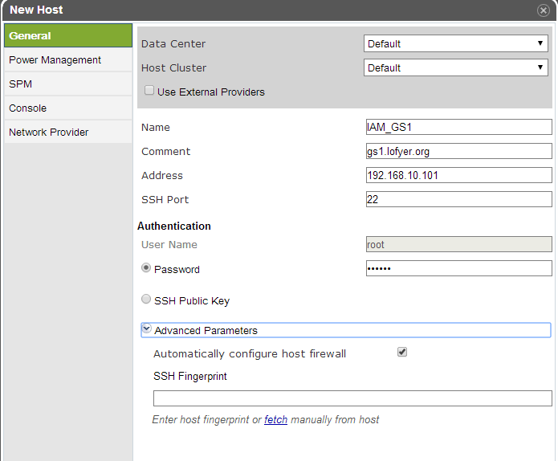
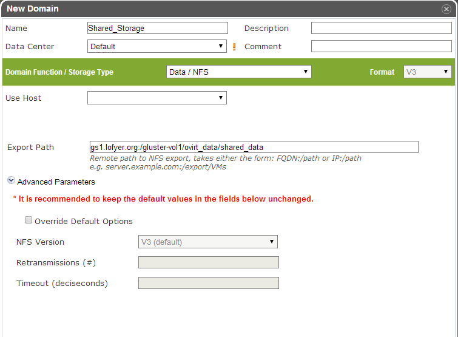

我想，你看到这的话应该已经有了一个数据中心、几个宿主机，也可能有一个虚拟机（engine），还差一个存储虚拟机镜像的地方就可以具有基本功能的oVirt平台了。

Ok, here we go.

## 添加节点（宿主机）

对于第11节的普通oVirt、第12节的ha平台，你可能需要添加更多节点以支持更好的SLA（service level agreement）。 添加节点目前有三种方式，一种是通过oVirt的节点ISO直接安装再加入，另一种是直接将现有CentOS或者Fedora转化为节点，另外还可以指定使用外部节点（Foreman），在此我们使用第二种方法。

## 添加存储域

存储域有3种，Data（数据域）、ISO（ISO域）、Export（导出域）。 其中，数据域是为必需，在创建任何虚拟机之前需要有一个可用的数据域用于存储虚拟磁盘以及快照文件；ISO域中可以存放ISO和VFD格式的系统镜像或者驱动文件；导出域用于导出或导入OVF格式的虚机。 而根据数据域的存储类型，我们有5种（NFS、POSIX兼容、Glusterfs、iSCSI、光纤）可选，在此，建议（为什么？）选择glusterfs导出的NFS。

_此图可以换掉_ 

**注意**：确保存储域权限为36:36，也即vdsm.kvm。
