# Server Preparation

ad(ad.virtfan.com): Windows Server 2012 R2 lync(lync.virtfan.com): Windows Server 2012 R2 Following instruction is for **LAN**.

Ref: [https://technet.microsoft.com/en-us/library/dn933900.aspx](https://technet.microsoft.com/en-us/library/dn933900.aspx) [Install lync 2013 server in win2008r2](http://lync.community.ge/post/2012/07/18/Install-Lync-2013-in-windows-server-2008-r2-(Part-1).aspx)

# Procedure

1\. After a fresh installation of Windows Server 2012 R2, we will **update** it to latest. 2. We need create an AD DS with AD CS in ad.virtfan.com. So that we can retrieve CA to complete our deployment. 3. Then we start setting up Skype Server in lync.virtfan.com(in domain virtfan.com). 4. Set up DNS, add more users, use lync to communicate.

## AD Preparation

Following steps are in ad.virtfan.com. 1. Assign a static IP. Change computer name to ad. [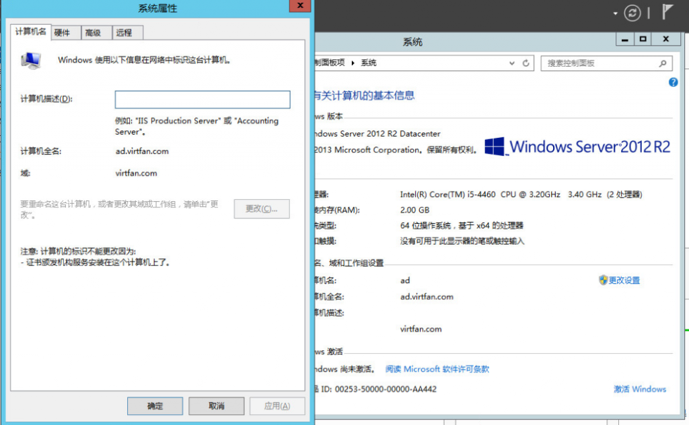](http://blog.lofyer.org/deploy-skype-for-business-server-2015/%e5%b1%8f%e5%b9%95%e5%bf%ab%e7%85%a7-2015-08-13-%e4%b8%8a%e5%8d%8811-42-27/) 2. Add Active Directory Domain Service and DNS Roles. Create a new forest(virtfan.com) with level Windows 2008 R2. [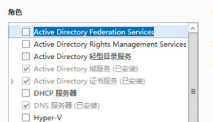](http://blog.lofyer.org/deploy-skype-for-business-server-2015/%e5%b1%8f%e5%b9%95%e5%bf%ab%e7%85%a7-2015-08-13-%e4%b8%8a%e5%8d%8811-59-27/) 3. Add Active Directory Certificate Service Role with all the six features checked. [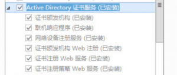](http://blog.lofyer.org/deploy-skype-for-business-server-2015/%e5%b1%8f%e5%b9%95%e5%bf%ab%e7%85%a7-2015-08-13-%e4%b8%8b%e5%8d%8812-07-28/) 4. (Optional)Run "gpmc.msc", right click on the Default Domain Policy to edit. Change Password Complexity to False. Run "gpupdate /force" to update the group policy. [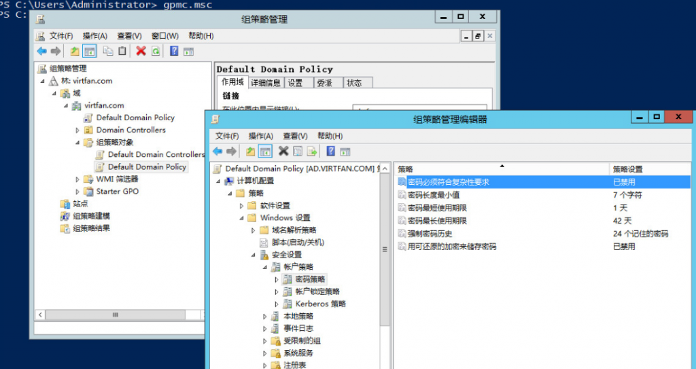](http://blog.lofyer.org/deploy-skype-for-business-server-2015/%e5%b1%8f%e5%b9%95%e5%bf%ab%e7%85%a7-2015-08-13-%e4%b8%8b%e5%8d%8812-15-33/)

## Skype Server Preparation

Following steps are in lync.virtfan.com. **Make sure you have got more than 32GB space in C:**. 1. Assign a static IP, change name to lync and join domain virtfan.com. Add following features: _.Net Framework 3.5, .Net Framework 4.5 -> WCF Services -> HTTP Activation, Media Foundation, Remote Server Administration Tools -> Role Administration Tools -> AD DS and AD LDS Tools -> Windows Identity Foundation 3.5_ 2. Add IIS Role with following features: _静态内容、默认文档、HTTP 错误、ASP.NET、.NET 扩展性、Internet 服务器 API (ISAPI)扩展、ISAPI 筛选器、HTTP 日志记录、日志记录工具、跟踪、客户端证书映射身份验证、Windows 身份验证、请求筛选、静态内容压缩、动态内容压缩、IIS 管理控制台、IIS 管理脚本和工具_ 3. **Logon as VIRTFAN\\Administrator** and add feature .Net3.5. 4. Install KB2982006. 5. Mount Skype Business 2015 ISO and run Setup to install.

## Setting up Skype Server

Following steps are in lync.virtfan.com and logon as VIRTFAN\\Administrator and add feature .Net3.5. 1. Create a directory in C:\\share, make it sharable and writable. 2. Run "Skype for Business Server 部署向导(Deploy Wizard)" from Start menu. [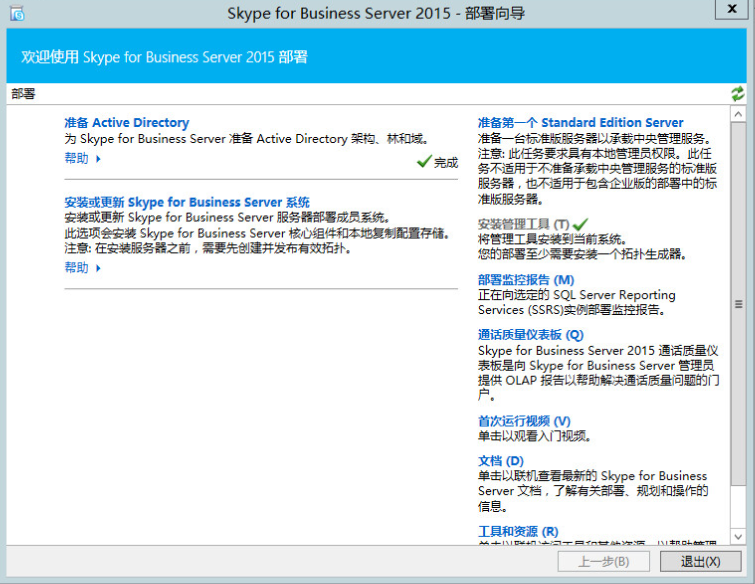](http://blog.lofyer.org/deploy-skype-for-business-server-2015/%e5%b1%8f%e5%b9%95%e5%bf%ab%e7%85%a7-2015-08-13-%e4%b8%8b%e5%8d%881-47-56/) 3. Then we will are going to follow the steps in "Prepare Active Directory". [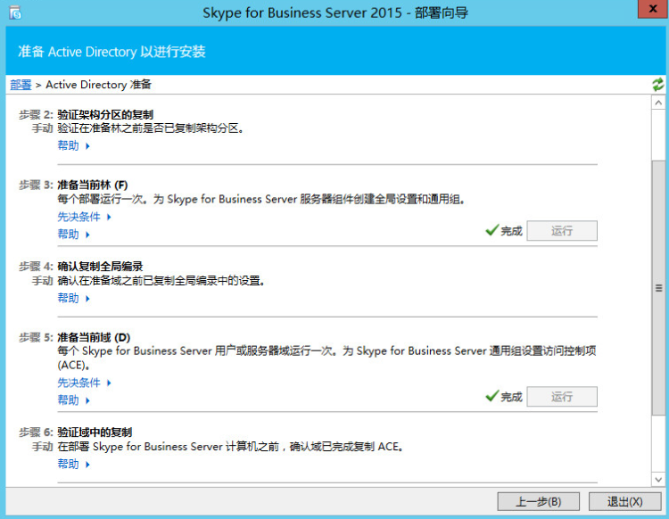](http://blog.lofyer.org/deploy-skype-for-business-server-2015/%e5%b1%8f%e5%b9%95%e5%bf%ab%e7%85%a7-2015-08-13-%e4%b8%8b%e5%8d%881-51-16/) 4. Click "Prepare the first Standard Edition Server". It will create database. 5. Install management utilities. 6. Run "Skype for Business Server topology generator" from Start menu to generate a topology. [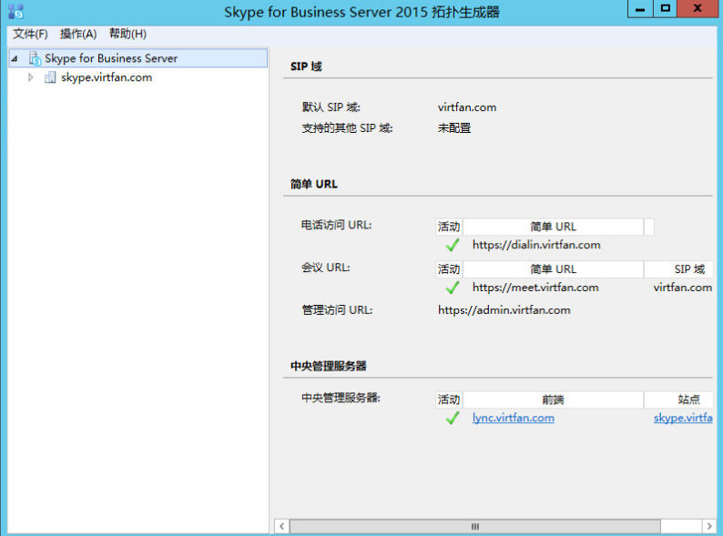](http://blog.lofyer.org/deploy-skype-for-business-server-2015/%e5%b1%8f%e5%b9%95%e5%bf%ab%e7%85%a7-2015-08-13-%e4%b8%8b%e5%8d%882-31-16/) 7. Create a new topology like this: [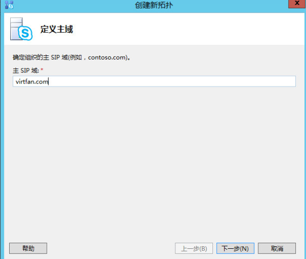](http://blog.lofyer.org/deploy-skype-for-business-server-2015/%e5%b1%8f%e5%b9%95%e5%bf%ab%e7%85%a7-2015-08-13-%e4%b8%8b%e5%8d%882-37-53/) [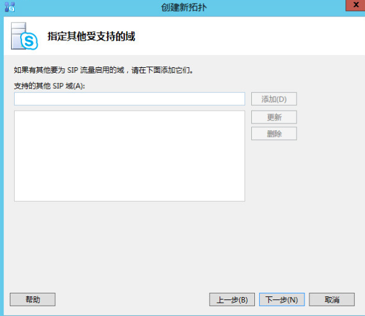](http://blog.lofyer.org/deploy-skype-for-business-server-2015/%e5%b1%8f%e5%b9%95%e5%bf%ab%e7%85%a7-2015-08-13-%e4%b8%8b%e5%8d%882-38-07/) [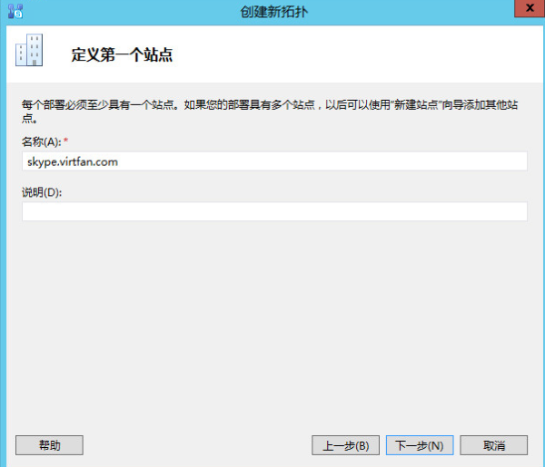](http://blog.lofyer.org/deploy-skype-for-business-server-2015/%e5%b1%8f%e5%b9%95%e5%bf%ab%e7%85%a7-2015-08-13-%e4%b8%8b%e5%8d%882-39-23/) [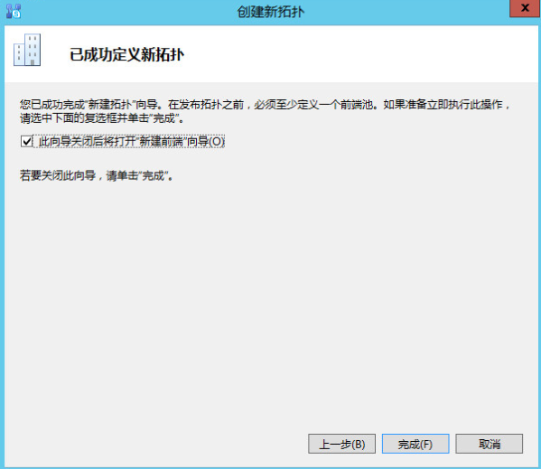](http://blog.lofyer.org/deploy-skype-for-business-server-2015/%e5%b1%8f%e5%b9%95%e5%bf%ab%e7%85%a7-2015-08-13-%e4%b8%8b%e5%8d%882-40-04/) [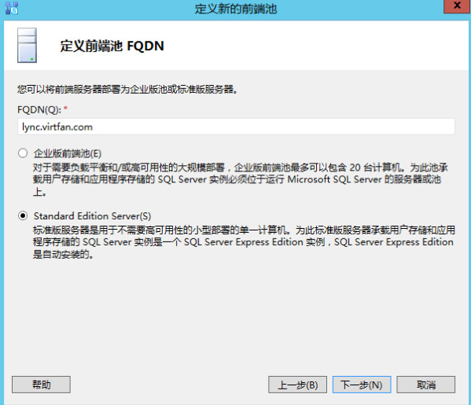](http://blog.lofyer.org/deploy-skype-for-business-server-2015/%e5%b1%8f%e5%b9%95%e5%bf%ab%e7%85%a7-2015-08-13-%e4%b8%8b%e5%8d%882-40-47/) [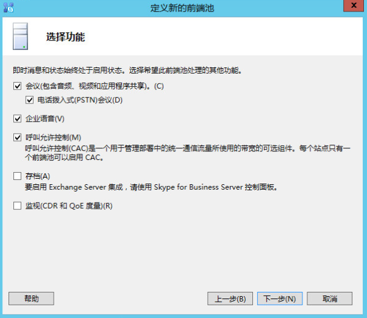](http://blog.lofyer.org/deploy-skype-for-business-server-2015/%e5%b1%8f%e5%b9%95%e5%bf%ab%e7%85%a7-2015-08-13-%e4%b8%8b%e5%8d%882-41-15/) [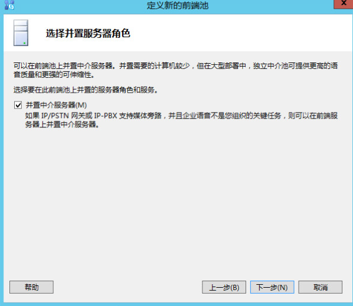](http://blog.lofyer.org/deploy-skype-for-business-server-2015/%e5%b1%8f%e5%b9%95%e5%bf%ab%e7%85%a7-2015-08-13-%e4%b8%8b%e5%8d%882-41-44/) [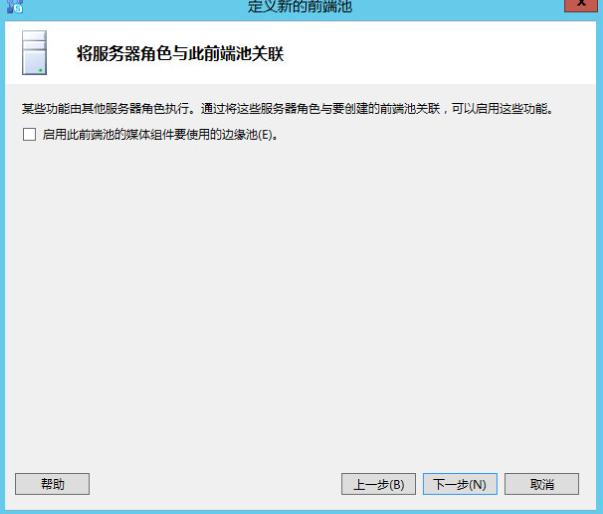](http://blog.lofyer.org/deploy-skype-for-business-server-2015/%e5%b1%8f%e5%b9%95%e5%bf%ab%e7%85%a7-2015-08-13-%e4%b8%8b%e5%8d%882-42-14/) [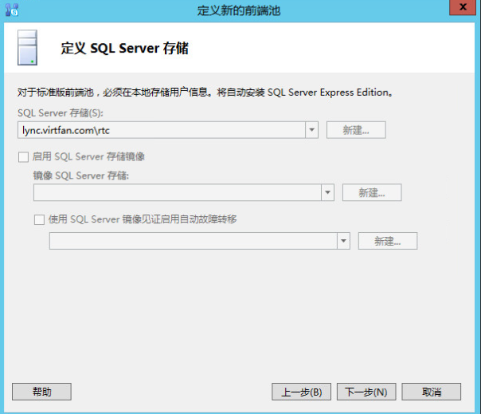](http://blog.lofyer.org/deploy-skype-for-business-server-2015/%e5%b1%8f%e5%b9%95%e5%bf%ab%e7%85%a7-2015-08-13-%e4%b8%8b%e5%8d%882-42-49/) [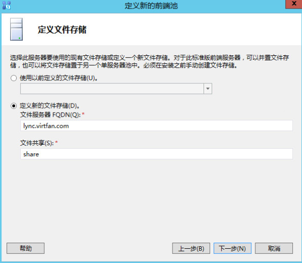](http://blog.lofyer.org/deploy-skype-for-business-server-2015/%e5%b1%8f%e5%b9%95%e5%bf%ab%e7%85%a7-2015-08-13-%e4%b8%8b%e5%8d%882-43-32/) [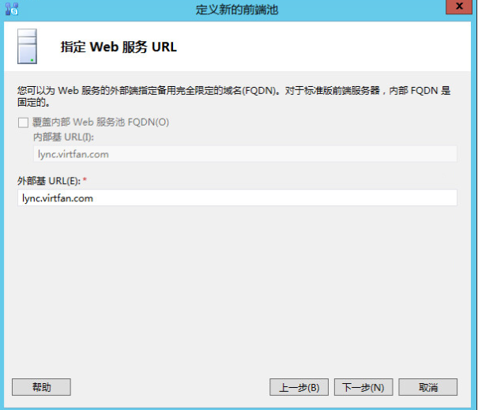](http://blog.lofyer.org/deploy-skype-for-business-server-2015/%e5%b1%8f%e5%b9%95%e5%bf%ab%e7%85%a7-2015-08-13-%e4%b8%8b%e5%8d%882-43-58/) [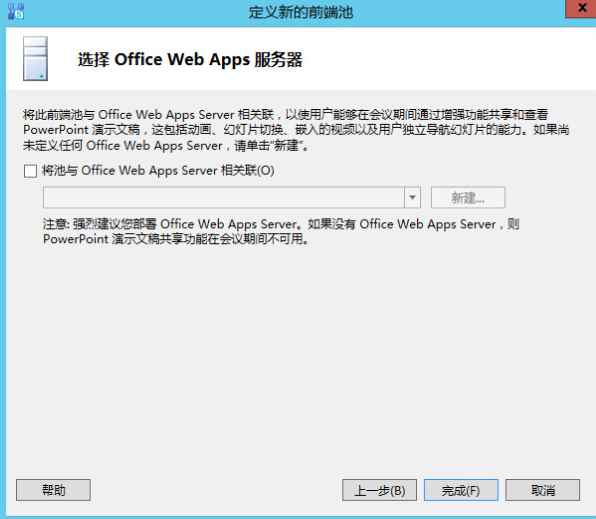](http://blog.lofyer.org/deploy-skype-for-business-server-2015/%e5%b1%8f%e5%b9%95%e5%bf%ab%e7%85%a7-2015-08-13-%e4%b8%8b%e5%8d%882-44-27/) Click "Finish" and right click on the "Skype for Business Server" to edit property. Fill in the admin url like: _https://admin.virtfan.com_ Select a fronted server as central server. [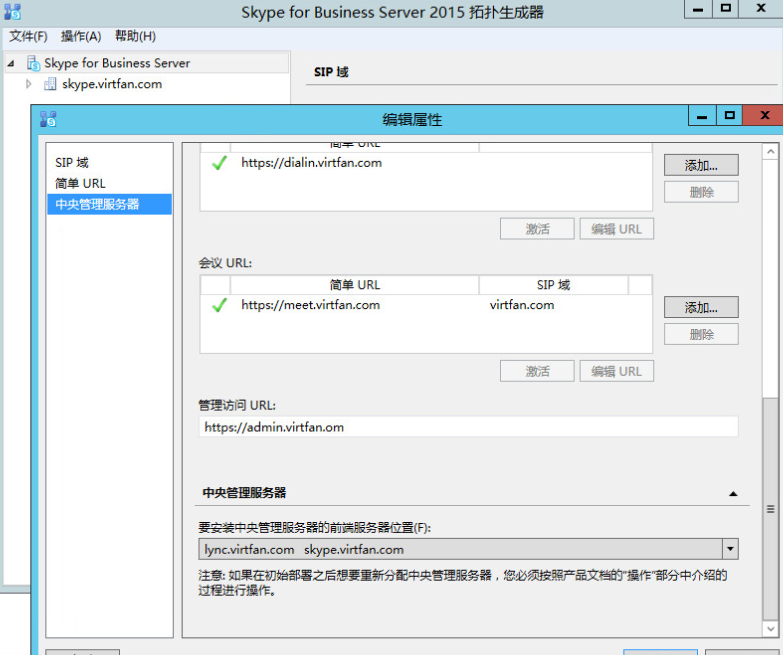](http://blog.lofyer.org/deploy-skype-for-business-server-2015/%e5%b1%8f%e5%b9%95%e5%bf%ab%e7%85%a7-2015-08-13-%e4%b8%8b%e5%8d%882-46-44/) 8. Publish topology. 9. Click "Install or update Skype for Business Server System". And follow its guide. [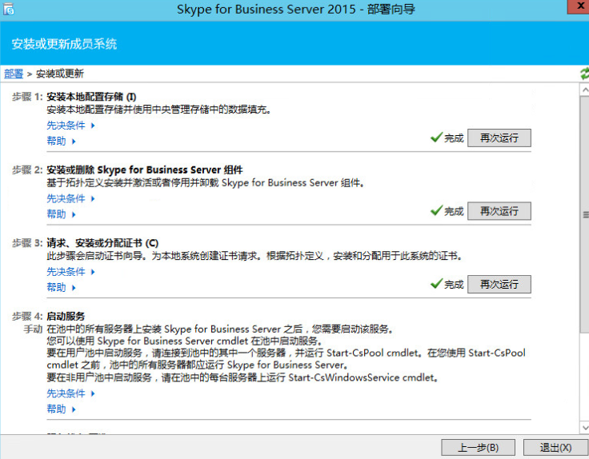](http://blog.lofyer.org/deploy-skype-for-business-server-2015/%e5%b1%8f%e5%b9%95%e5%bf%ab%e7%85%a7-2015-08-13-%e4%b8%8b%e5%8d%882-52-18/) 10. When you are in Step.3(Assign Certificate). Click "Request" to request certificate from ad.virtfan.com. [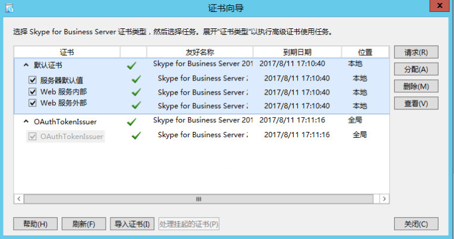](http://blog.lofyer.org/deploy-skype-for-business-server-2015/%e5%b1%8f%e5%b9%95%e5%bf%ab%e7%85%a7-2015-08-13-%e4%b8%8b%e5%8d%882-53-49/) [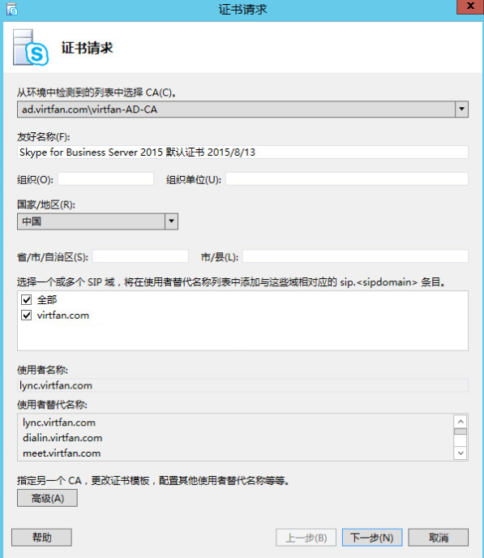](http://blog.lofyer.org/deploy-skype-for-business-server-2015/%e5%b1%8f%e5%b9%95%e5%bf%ab%e7%85%a7-2015-08-13-%e4%b8%8b%e5%8d%882-54-39/)  11. Run "start-cspool" from cmd to start the server. Warning is OK, error is not OK. 12. Define your DNS and port-forwarding(443) so that we can use Skype from WAN.

https://meet.virtfan.com  ->  lync.virtfan.com's IP
https://lync.virtfan.com  ->  lync.virtfan.com's IP
https://dialin.virtfan.com  ->  lync.virtfan.com's IP
https://admin.virtfan.com  ->  lync.virtfan.com's IP
(optional)https://ad.virtfan.com  ->  ad.virtfan.com's IP

13\. Add domain users and assign users via https://admin.virtfan.com. [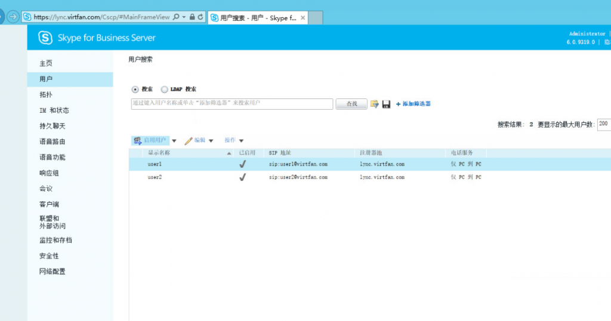](http://blog.lofyer.org/deploy-skype-for-business-server-2015/%e5%b1%8f%e5%b9%95%e5%bf%ab%e7%85%a7-2015-08-13-%e4%b8%8b%e5%8d%883-10-58/)

# Lync/Skype Client

1\. Install Lync/Skype within Microsoft Office 2013 or Office365. 2. Download and install CA from https://ad.virtfan.com/certsrv/ or you can put it somewhere else. 3. Configure your client like this:  4. Click Logon.

Here you go!

# WAN

If you are using servers behind a firewall or a router, you should add something like this. 1. On your DNS provider, set these 6 A records lync/admin/dialin/meet/lyncdiscover/lyncdiscoverinternal.virtfan.com to your WAN IP. 2. Port forward from 443,5601 to lync server LAN IP. (Alternative)2. If you are using Apache virtualhost, you'll need export certificate and its private key of lync.virtfan.com to the Apache server with [jailbreak](https://github.com/iSECPartners/jailbreak-Windows.git) and configure all 6 domain names like this:

\# vi /apache/conf.d/ssl.conf
...
<VirtualHost \*:443>
ServerName skype.virtfan.com
SSLEngine on
SSLProxyEngine on
SSLCertificateFile /etc/httpd/conf.d/lync-ca/lync.virtfan.com.cer
SSLCertificateKeyFile /etc/httpd/conf.d/lync-ca/lync.virtfan.com.key
ProxyRequests Off
ProxyPass / https://skype.virtfan.com/
ProxyPassReverse / https://skype.virtfan.com/
</VirtualHost>
...

# vi /etc/httpd/conf.d/vproxy.conf

<VirtualHost \*:80>
    ServerName lyncdiscover.virtfan.com
    ProxyRequests Off
    ProxyPass / http://lyncdiscover.virtfan.com/
    ProxyPassReverse / http://lyncdiscover.virtfan.com/
</VirtualHost>

<VirtualHost \*:80>
    ServerName lyncdiscoverinternal.virtfan.com
    ProxyRequests Off
    ProxyPass / http://lyncdiscoverinternal.virtfan.com/
    ProxyPassReverse / http://lyncdiscoverinternal.virtfan.com/
</VirtualHost>

 

# vi /etc/hosts
...
192.168.122.222 admin.virtfan.com
192.168.122.222 lync.virtfan.com
192.168.122.222 dialin.virtfan.com
192.168.122.222 skype.virtfan.com
192.168.122.222 meet.virtfan.com
192.168.122.222 lyncdiscover.virtfan.com
192.168.122.222 lyncdiscoverinternal.virtfan.com
...

And configure iptables:

\# iptables -t nat -A PREROUTING -p tcp  --dport 5061 -j DNAT --to-destination 192.168.122.222:5061

3\. DO NOT ADD "Internal Server" in your lync client, "External Server" will be enough.
