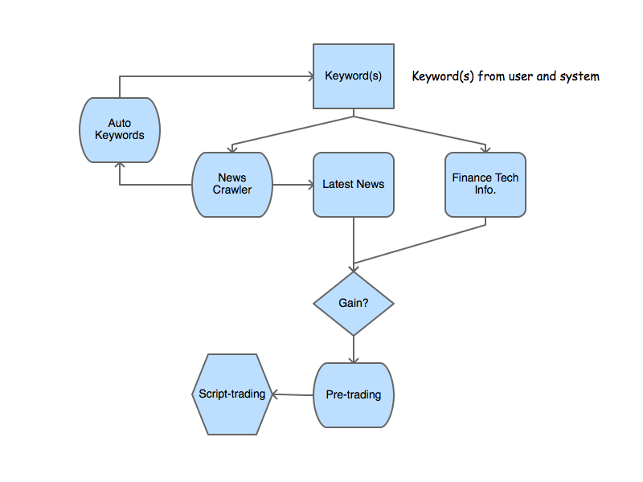

Here's the sketch. 

Source code. [https://github.com/lofyer/trade-model-01](https://github.com/lofyer/trade-model-01)

目前新闻收集已经OK，搜索也已OK，趋势关键字尚未完成。

交易算法学习中，外汇历史收集中，学习策略未完成。

已升级为[quantum-trade-model](https://github.com/lofyer/quantum-trade-model)

对应文章为[数据笔记](http://datanote.readthedocs.io/zh/latest/)

**媒体发布-筛选服务** 官网

公众号

**策略研究-会员服务**

趋势总结（新闻关键字，暗网关键字，地图，pdf报告）

世界指标（政治稳定度，经济稳定度，社会指标）

交易模型（算法实现，托管交易，代码托管PaaS）

**技术博客**

平台文章

Timeline: 2016-7 模型学习、算法学习、平台构建、渠道收集 2016-8 算法学习、平台构建、趋势输出

[示例站点](https://forex.fusionworks.cn) 

<iframe src="https://forex.fusionworks.cn" width="100%" height="600"></iframe>
