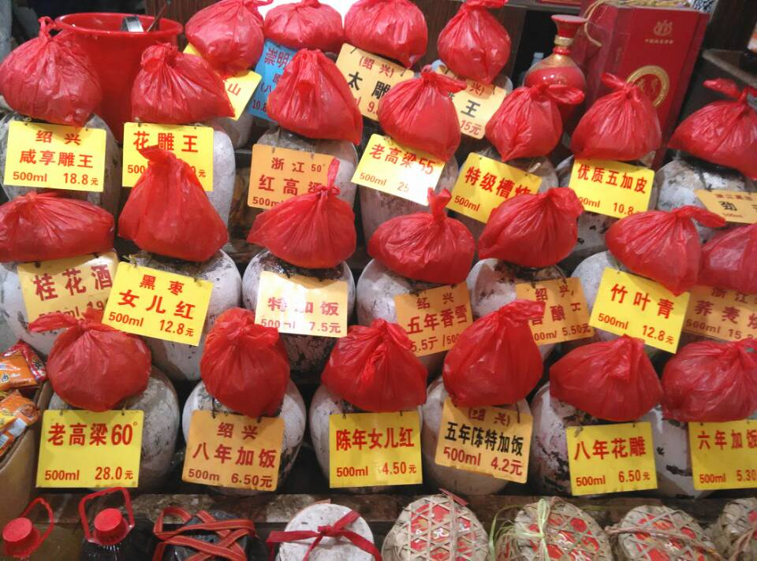
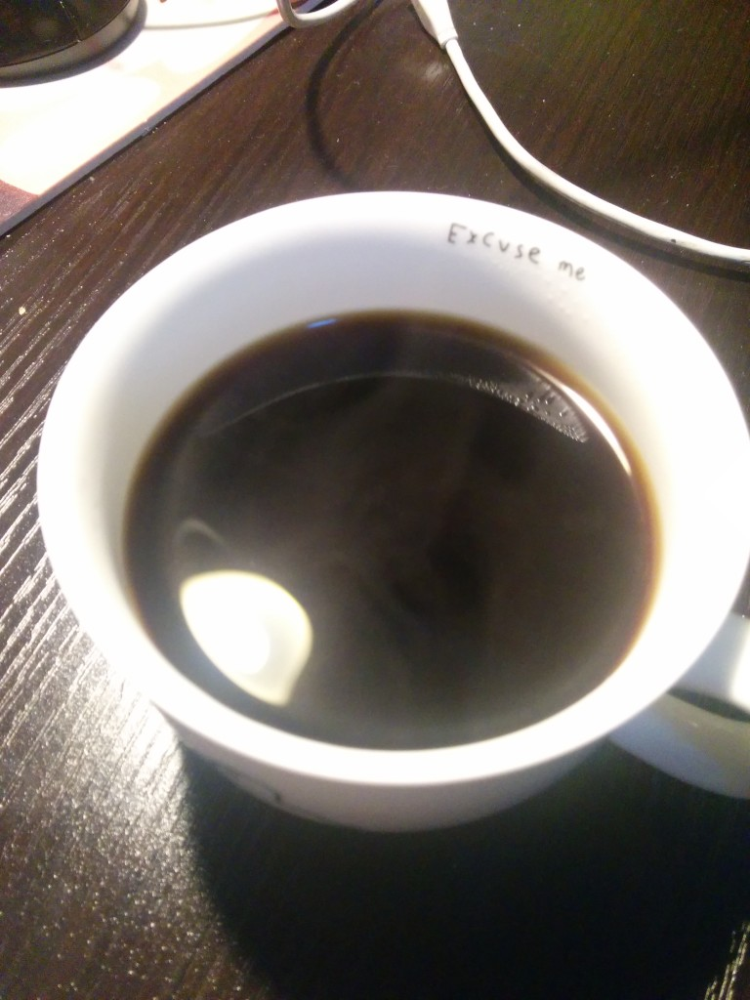
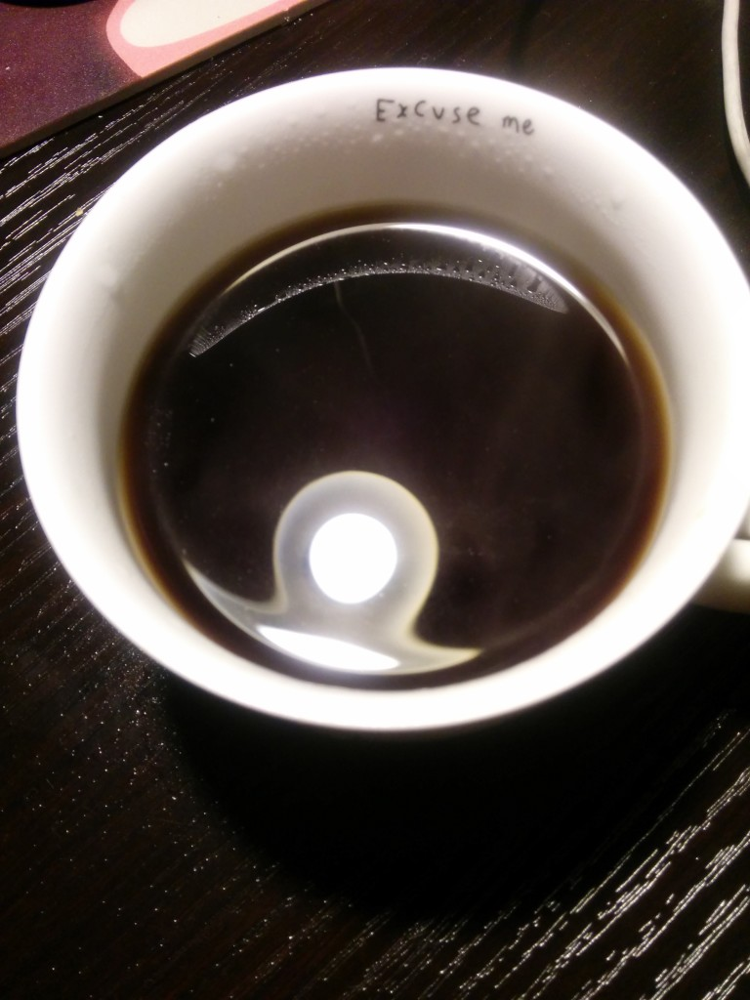
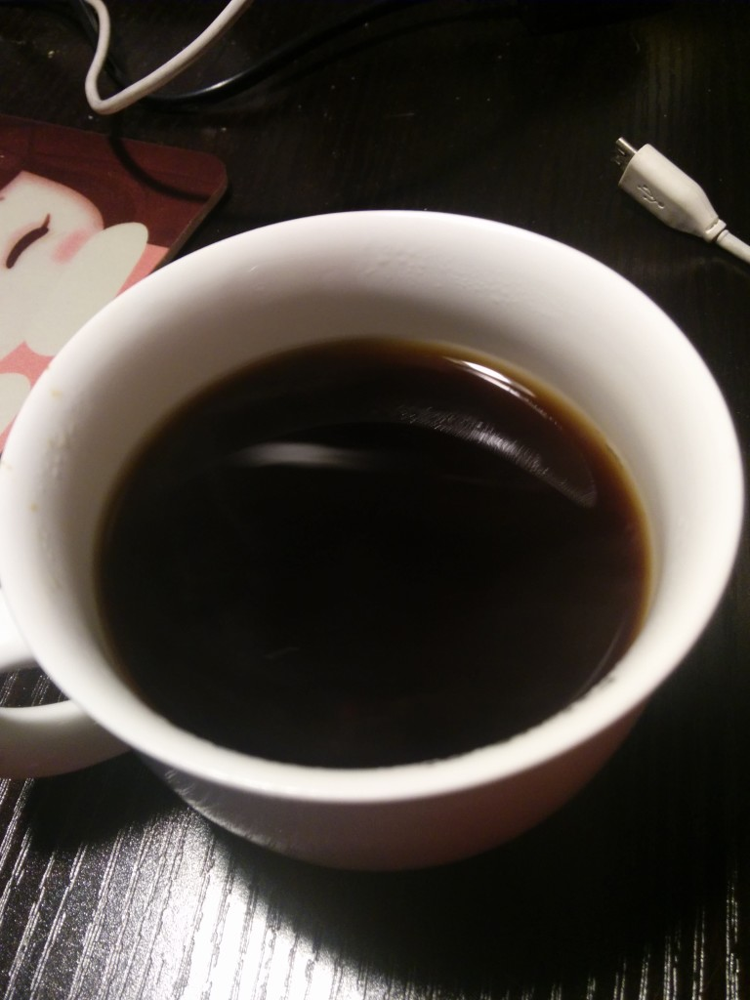
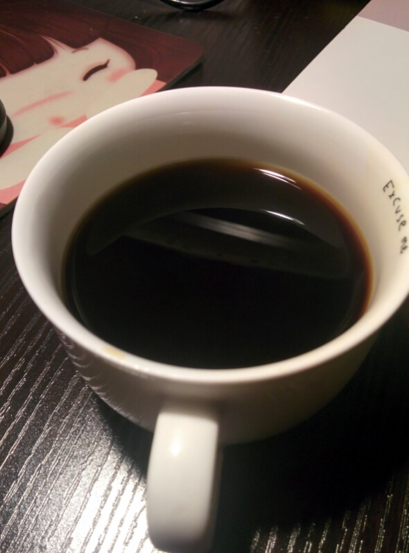
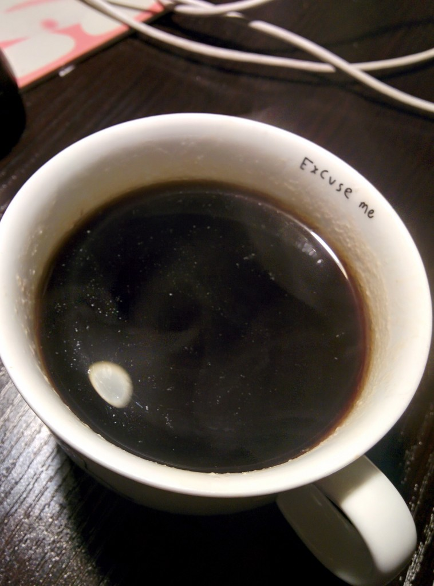
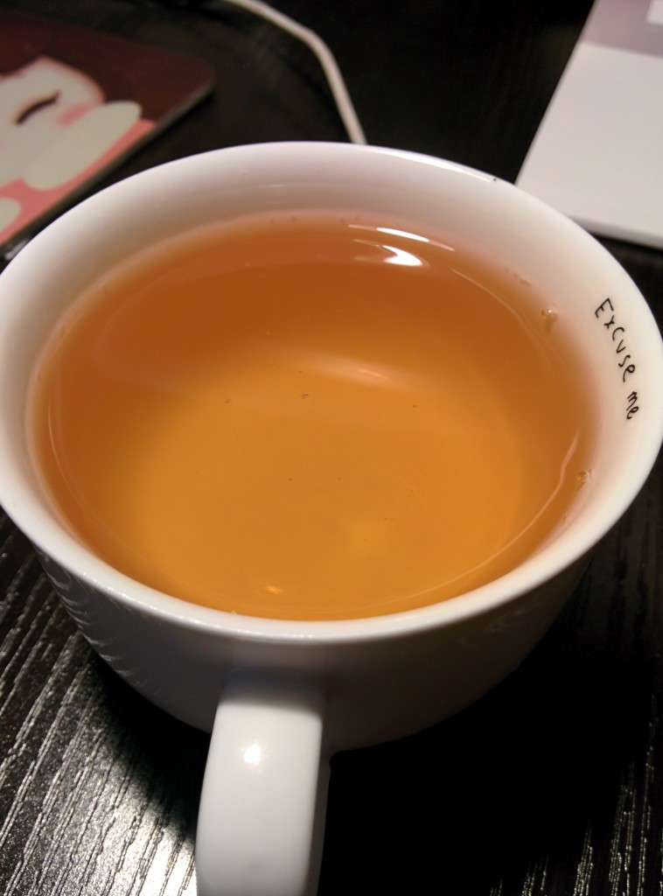
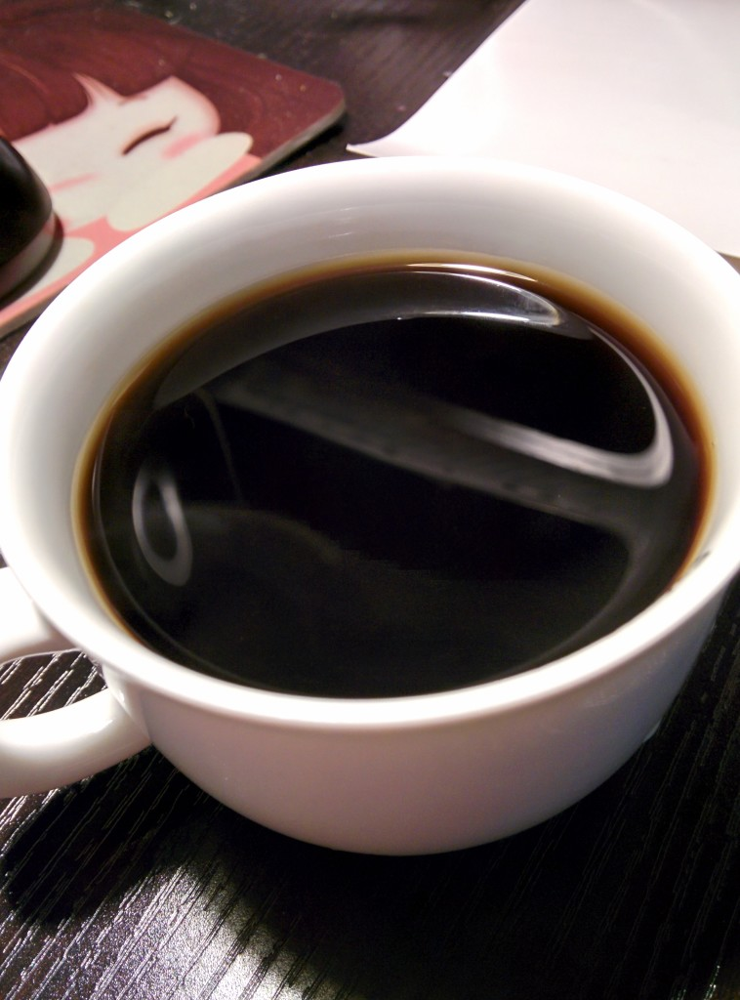
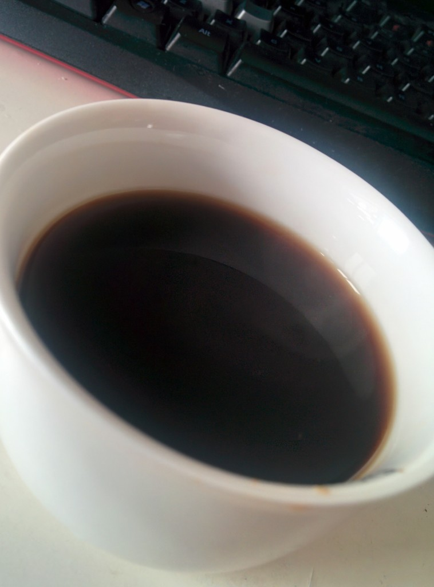
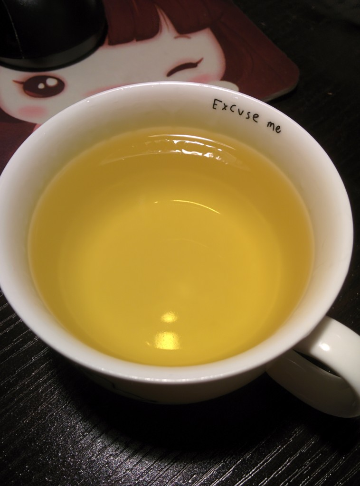

偶见楼下一黄酒店铺，坛中酒对于我这个北方人来说有些罕见，于是便提了三斤加饭回家，两天后觉得不错，便出此念想：尝遍门店甘酿。

**2015.3.10 绍兴咸亨雕王** 加热后甜味浮出，入口颇顺，酒意略潜。 

**2015.3.10 绍兴花雕王** 为入口已有红枣泥香，酒意浅，连续品尝后有一丝苦涩。 

**2015.3.10 绍兴八年加饭** 酒意刚好，也有红枣泥香。 

**2015.3.12 绍兴太雕** 加热后酒意略浓，听老板说近年太雕不如花雕王卖的好，人总是会变的。 

**2015.3.16 黑枣女儿红** 枣香不如花雕浓郁，酒意略浓。 

**2015.3.16 桂花酒** 未加热前，满满桂花香，加热后，伴着酒醇飘出，另外，从颜色看，这才叫黄酒啊。 

**2015.3.17 古越龙山** 名字好听，入口易，酒意浅。 

**2015.3.17 状元红** 与花雕王差不多，但是枣香更浓。 

**2015.3.18 竹叶青** 药酒，味不如名，也有可能是这家酿造的方法问题，不好喝。 
