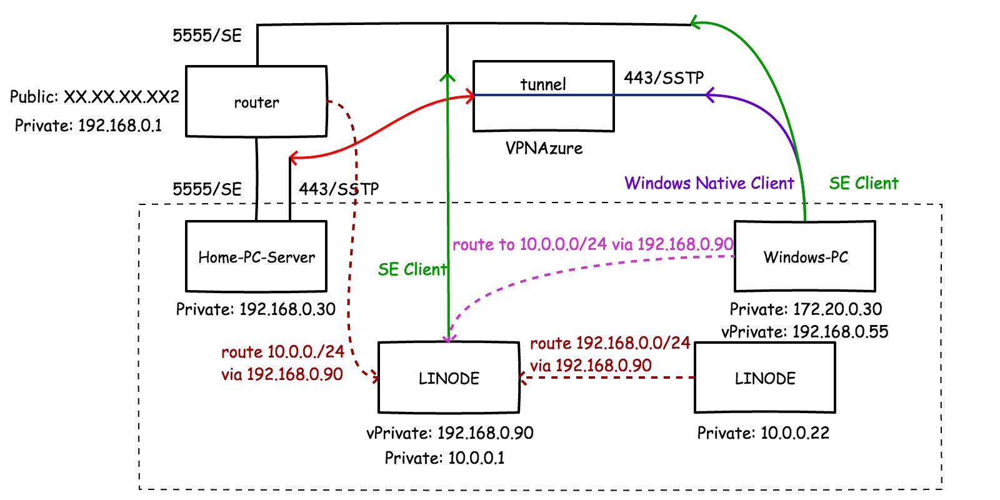

名字起的不好听，不过无所谓，也是混合云了，做到了什么地步呢？ 在数据层面，家中机器和linode以及gcp公有云全通，任意地点的客户端可以通过局域网地址访问家中和公有云，而这一且，只需要一个公网IP。那么如何组建呢？

1\. **选择一个趁手的VPN**，这里我使用的是SoftEther，全平台全功能，图形界面客户端全都有，自带域名反向解析，自带公网，又那么稳定，为啥不用。 只要在家中的一台PC上装好服务端，把5555端口通过路由器（有公网IP）映射出去即可完成VPN服务器的搭建。

2\. **Linode服务器集群选择一台作为网关（边界路由器）**，负责作为客户端接入VPN服务器，那么它就有了192.168.0段的地址，其它机器上因为linode没有VPC的概念，所以得加条到192.168.0.0/24的路由。

3\. 总结下来，接入到home的VPN服务器会给所有客户端一个home的IP地址，然后加的路由表（使linode集群的10段暴露出去）都围绕这个地址展开达到互通的目的。

4\. 目前我把linode上分散在全球8个机房的私有服务器都加了进来，当然，安全线路。尝试了一次kcptun加速VPN连接，但是linux下失败了，windows成功。

这是图，PC-Server为VPN服务器，LINODE为公有云，也加入了Google的公有云进去（没画），Windows-PC为个人服务器。

联通之后，Google的CDN、DNS可以混合到Linode去使用了，再展开点，大数据、数据库都可以结合Linode去跑了。
