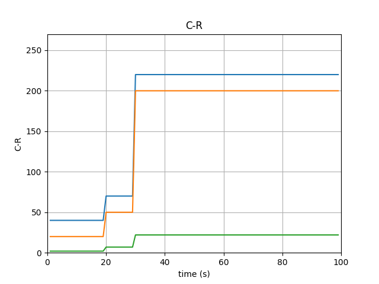
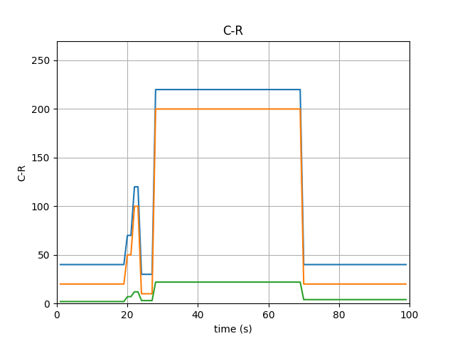
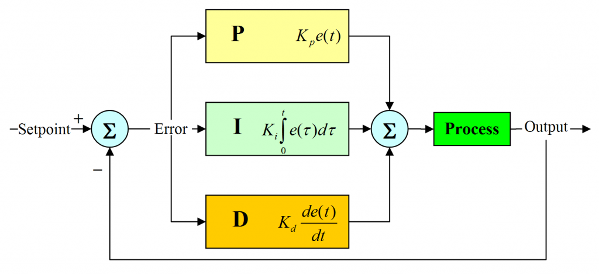
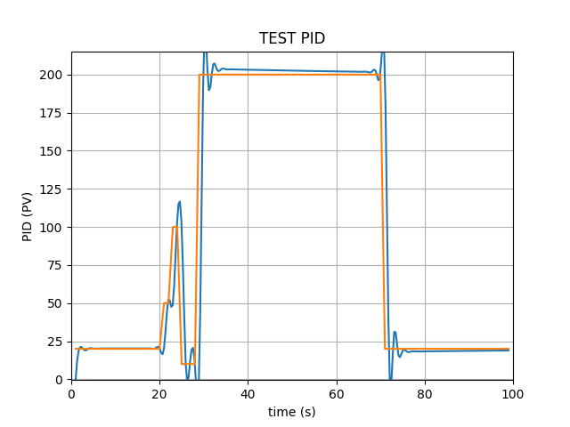

本文的实现效率尚有待考证，极有可能沦为扯淡文，但如果在网络资源部分可以快速应用测试。

众所周知，很多计算机系统里的设计都可以描述为线性模型，但正如金融系统的发展，计算机系统直接面向大众以后，也会呈现出非线性的特征，比如典型的DDoS即是在系统设计之外。接下来，笔者将使用自控知识来设计一种自适应负载的云计算控制器，不仅适用于计算、也会适用于网络、存储等服务资源。

以OpenStack平台的计算（虚拟机）为例，当用户的计算需求被量化后，那么我们就能根据其需求直接给出相应数量的计算节点。假如用户的计算需求是变化的，其值为R，且我们的程序员也是个直肠子，给出相应的计算能力为C，那么他设计的程序很有可能就是这个公式：

N=10,
R=n\*N,
C=(n+2)\*N

每台虚拟机的计算能力N为10，虚拟机数量为n。

可以看出他给了两台的冗余量，啊哈，还不错。所以他期望的场景应该是这样的。

其中黄色为实际需求，蓝色为平台提供,绿色为虚拟机数量。

但是，假如需求呈现出短时间大量波动的话，比如下图。

 这个时候事情就不是那么美妙了，平台在即时响应的同时，伴随着大量虚拟机的上线/下线，从而造成一定的资源请求拥堵，降低控制性能。

接下来，我们尝试引入PID回馈控制器，就是这个样子的。

PID的Python代码实现如下：

!/usr/bin/python

import time

class PID:
    def \_\_init\_\_(self, P=0.2, I=0.0, D=0.0):

        self.Kp = P
        self.Ki = I
        self.Kd = D

        self.sample\_time = 0.00
        self.current\_time = time.time()
        self.last\_time = self.current\_time

        self.clear()

    def clear(self):
        #Clears PID computations and coefficients
        self.SetPoint = 0.0

        self.PTerm = 0.0
        self.ITerm = 0.0
        self.DTerm = 0.0
        self.last\_error = 0.0

        # Windup Guard
        self.int\_error = 0.0
        self.windup\_guard = 20.0

        self.output = 0.0

    def update(self, feedback\_value):
        # Calculates PID value for given reference feedback

        error = self.SetPoint - feedback\_value

        self.current\_time = time.time()
        delta\_time = self.current\_time - self.last\_time
        delta\_error = error - self.last\_error

        if (delta\_time >= self.sample\_time):
            self.PTerm = self.Kp \* error
            self.ITerm += error \* delta\_time

            if (self.ITerm < -self.windup\_guard):
                self.ITerm = -self.windup\_guard
            elif (self.ITerm > self.windup\_guard):
                self.ITerm = self.windup\_guard

            self.DTerm = 0.0
            if delta\_time > 0:
                self.DTerm = delta\_error / delta\_time

            # Remember last time and last error for next calculation
            self.last\_time = self.current\_time
            self.last\_error = error

            self.output = self.PTerm + (self.Ki \* self.ITerm) + (self.Kd \* self.DTerm)

    def setKp(self, proportional\_gain):
        # Determines how aggressively the PID reacts to the current error with setting Proportional Gain
        self.Kp = proportional\_gain

    def setKi(self, integral\_gain):
        # Determines how aggressively the PID reacts to the current error with setting Integral Gain
        self.Ki = integral\_gain

    def setKd(self, derivative\_gain):
        # Determines how aggressively the PID reacts to the current error with setting Derivative Gain
        self.Kd = derivative\_gain

    def setWindup(self, windup):
        # unwound
        self.windup\_guard = windup

    def setSampleTime(self, sample\_time):
        # PID that should be updated at a regular interval.
        self.sample\_time = sample\_time

然后在上图条件下进行PID控制，代码如下：

import PID
import time
import matplotlib.pyplot as plt
import numpy as np
from scipy.interpolate import spline

def test\_pid(P = 0.2,  I = 0.0, D= 0.0, L=100):
    """Self-test PID class

    .. note::
        ...
        for i in range(1, END):
            pid.update(feedback)
            output = pid.output
            if pid.SetPoint > 0:
                feedback += (output - (1/i))
            if i>9:
                pid.SetPoint = 1
            time.sleep(0.02)
        ---
    """
    pid = PID.PID(P, I, D)
    pid.clear()
    pid.SetPoint=0.0
    pid.setSampleTime(0.01)

    END = L
    feedback = 0

    feedback\_list = \[\]
    time\_list = \[\]
    setpoint\_list = \[\]

    for i in range(1, END):
        pid.update(feedback)
        output = pid.output
        if pid.SetPoint > 0:
            feedback += (output - (1/i))
        if i<10:
            pid.SetPoint = 20
        if i>20:
            pid.SetPoint = 50
        if i>22:
            pid.SetPoint = 100
        if i>24:
            pid.SetPoint = 10
        if i>28:
            pid.SetPoint = 200
        if i>30:
            pid.SetPoint = 200
        if i>70:
            pid.SetPoint = 20

        feedback\_list.append(feedback)
        setpoint\_list.append(pid.SetPoint)
        time\_list.append(i)
        time.sleep(0.02)

    time\_sm = np.array(time\_list)
    time\_smooth = np.linspace(time\_sm.min(), time\_sm.max(), 300)
    feedback\_smooth = spline(time\_list, feedback\_list, time\_smooth)

    plt.plot(time\_smooth, feedback\_smooth)
    plt.plot(time\_list, setpoint\_list)
    plt.xlim((0, L))
    plt.ylim((min(feedback\_list)-0.5, max(feedback\_list)+0.5))
    plt.xlabel('time (s)')
    plt.ylabel('PID C-R')

    plt.grid(True)
    plt.show()

if \_\_name\_\_ == "\_\_main\_\_":
    test\_pid(1.01, 1, 0.001, L=100)

然后看看现在是什么样呢？

嗯，没错，多了一些调节量（超调量），且变化较之前平稳了一些。这些调节量是否适用于大批量的云计算环境还有待验证，但是以Web应用来看，这些调节量理应工作。

另外，考虑到虚拟机在创建后某些应用可能短时间内不接受下调，所以我们可以动态地调节C的值，即PID的输出仅用作参考。
