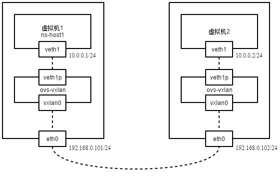

这是一篇入门文章，帮助初学者理清VxLAN的基本原理与使用，ovs只是工具，新版本内核也可使用ip命令直接创建。

本篇内容分为两篇，第一篇是使用简单VxLAN通道网络，第二篇会接入OVS模拟的VTEP设备。

# 一、使用VxLAN通道

原理是在网络命名空间上（仅测试环境），创建对端接口（peer/patch，虚拟化环境中即是虚拟机veth设备接口与OVS tun接口），以通过VxLAN通道与彼此通信。

host1拥有物理接口eth0（192.168.0.101），host2拥有物理接口eth0（192.168.0.102），两者在同一局域网中。

实验拓扑如下图。

在host1上创建veth与对端接口，对端接口会与ovs网桥相连，其中veth1代表虚拟机接口（地址为10.0.0.1），veth1p代表与ovs网桥相连的接口。

\# 添加网络命名空间
ip netns add ns-host1
# 添加对端接口
ip link add name veth1 type veth peer name veth1p
# 将虚拟机接口放入命名空间
ip link set dev veth1 netns ns-host1
# 设置虚拟机接口IP
ip netns exec ns-host1 ifconfig veth1 10.0.0.1/24 up

# 添加ovs网桥
ovs-vsctl add-br ovs-vxlan
# 将虚拟机的对端接口放入命名空间
ovs-vsctl add-port ovs-vxlan veth1p
# 激活接口
ip link set ovs-vxlan up
ip link set veth1p up

同样在host2上创建。

ip netns add ns-host2
ip link add name veth1 type veth peer name veth1p
ip link set dev veth1 netns ns-host2
ip netns exec ns-host2 ifconfig veth1 10.0.0.2/24 up

ovs-vsctl add-br ovs-vxlan
ovs-vsctl add-port ovs-vxlan veth1p
ip link set ovs-vxlan up
ip link set veth1p up

然后，分别在host1与host2上创建VxLAN通道。

host1，将VxLAN的对端指向host2的eth0，VNI（VXLAN Network Identifier）为123。

ovs-vsctl add-port ovs-vxlan vxlan0 -- set interface vxlan0 type=vxlan options:remote\_ip=192.168.0.102 options:key=123

host2，将VxLAN的对端指向host2的eth0。

ovs-vsctl add-port ovs-vxlan vxlan0 -- set interface vxlan0 type=vxlan options:remote\_ip=192.168.0.101 options:key=123

这样即可完成最简单的OVS VxLAN实验准备，在host2上的虚拟机尝试ping host1上的虚拟机。

ip netns exec ns-host2 ping 10.0.0.1
PING 10.0.0.1 (10.0.0.1) 56(84) bytes of data.
64 bytes from 10.0.0.1: icmp\_seq=1 ttl=64 time=1.74 ms
64 bytes from 10.0.0.1: icmp\_seq=2 ttl=64 time=0.734 ms
64 bytes from 10.0.0.1: icmp\_seq=3 ttl=64 time=0.669 ms

这里可以将主机上的物理接口，比如eth1加入到ovs-vxlan中，从而使得与其相连的主机或者网络设备能够接入此VxLAN网络； 当添加第三台主机时，使用gre网络需要在每个gre0中设置remote\_ip以两两相连，可以是星形或者环形（打开ovs生成树协议，ovs-vsctl set bridge ovs-gre stp\_enable=true），而VxLAN网络

# 二、使用VxLAN通道连接虚拟机与物理机

# 三、接入OVS VTEP设备

参考： [brctl与bridge命令对比](https://sgros-students.blogspot.com/2013/11/comparison-of-brctl-and-bridge-commands.html) [在oVirt中使用ovs gre网络](https://github.com/lofyer/scripts/blob/6e9fd04cd6209459745f83dc8b303494992b2544/libvirt/ovs-howto.txt) [搭建基于Open vSwitch的VxLAN隧道实验](https://www.sdnlab.com/5365.html) [Connecting VMs Using Tunnels (Userspace)](http://docs.openvswitch.org/en/latest/howto/userspace-tunneling/)
