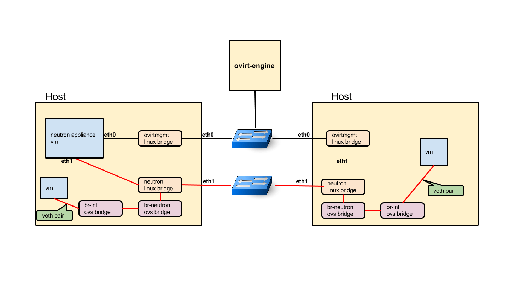

以笔者目前对ZStack源码的掌握，并不能较为产品化地集成Neutron，所以只能用点稍微hack的技巧将其用起来。

实验材料：ZStack单机版，OpenStack Neutron with Dashboard and OVS bridge

实验目的：通过修改ZStack实例的开机xml(或者新建主机时修改网络为openvswitch bridge)，调用Neutron API，并将实例网络桥接至OVS网桥。

实验步骤：

1\. 搭建ZStack，略。

2\. 搭建OpenStack Neutron实例，参考脚本https://...

3\. 编写hook脚本

4\. 开机测试

5\. 通过OpenStack Dashboard查看

实验思考：

这就是KVM平台的好处，互操作性杠杠的。另外，Neutron可作为VM Appliance单独提供，加上Cloud-Init就更好了。

实验过程：

**1\. 集成oVirt与Neutron**

**2\. 集成ZStack与Neutron**

**3\. Neutron与其产品的集成**

参考链接：

[http://www.ovirt.org/develop/release-management/features/cloud/neutronvirtualappliance/](http://www.ovirt.org/develop/release-management/features/cloud/neutronvirtualappliance/)

TBD

