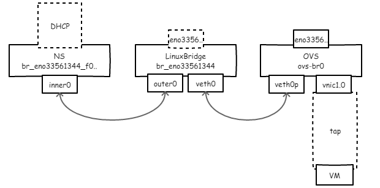
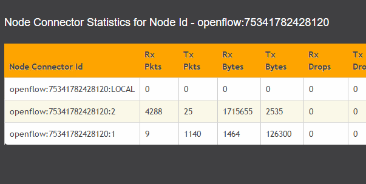
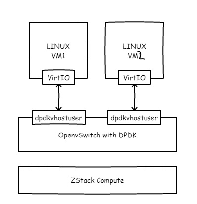

这篇文章较之前的ZStack+Neutron更为简单，由于ZStack的vxlan实现没有使用ovs，所以。。我不管了，直接ovs吧。另外，你如果使用了vyos，我没研究，可以等到下一期处理。

以下方法仅仅从实现角度出发，理应适用于其他平台，如果是正经的集成，请自己编写模块。

环境：单台主机有两个网卡，相同网段（纯粹方便使用而搞，不要学习），ZStack已经安装，其中eno16780032为管理网络，eno33561344为ZStack二层网络接口，三层网络novlan。

**集成OVS/ODL**

1\. 于计算节点中安装openvswitch。

wget https://repos.fedorapeople.org/repos/openstack/openstack-ocata/rdo-release-ocata-3.noarch.rpm
rpm -i rdo-release-ocata-3.noarch.rpm
yum --enablerepo=\* install -y openvswitch
# yum --enablerepo=\* install -y openvswitch-ovn\*
systemctl enable openvswitch
systemctl start openvswitch

2\. 接下来我给你解释一下，要怎么做了。 首先，由于ZStack的flat网络使用了network namespace，通过一对pair将其与linuxbridge相连，ns内的叫inner0，外部的叫outer0；其中ns中会有dnsmasq启动的dhcp服务，我们将ns看作一个带dhcp的功能交换机好了，仅仅提供dhcp能力。

然后，我们要创建一个ovs，为了将虚拟机的网口vnic1.0能够通过ovs进行控制，同时与dhcp交换机接通，我们需要一根线将ovs与linuxbridge接起来，如此一来，看下图（幸苦画的ASCII图没了！）。

\# 创建ovs
ovs-vsctl add-br ovs-br0
ip link set dev ovs-br0 up

# 创建接口对
ip link add name veth0 type veth peer name veth0p

# 开始扎物理网线
brctl delif br\_eno16780032 eno16780032
ovs-vsctl add-port ovs-br0 br\_eno16780032

# 扎接口对
brctl addif br\_eno16780032 veth0
ovs-vsctl add-port ovs-br0 veth0p
ip link set dev veth0 up
ip link set dev veth0p up

最后由于我们的虚拟机接口vnic1.0每次都会创建到linuxbridge上，所以我们要把它拔下来插ovs上从而可以进行流表控制（可以保存为脚本）。

brctl delif br\_eno16780032 vnic1.0
ovs-vsctl add-port ovs-br0 vnic1.0

> Q: 为啥要把物理网口eno33561344放到ovs里？ A: 为了保持纯粹 ：）
> 
> Q: 为啥不把outer0直接放到ovs里？ A: ZStack逻辑每次创建虚拟机都会试图把outer0加到linuxbridge里，如果已经加到其他网桥虚拟机创建会失败。

最后，把物理机的OVS实例交给ODL处理吧，不画图了。

ovs-vsctl set-manager tcp:opendaylight\_ip:6640
# 也可以单独设置网桥的控制器，如果不想全被控制的话
ovs-vsctl set-controller ovs-br0 tcp:controller\_ip:6633

# 安装ODL的插件
cd ODL\_DIR
./bin/bash
./bin/client
# 安装netvirt与dlux界面，安装netvirt与yang
opendaylight-user@root> feature:install odl-netvirt-openstack odl-dlux-all odl-dlux-yangman odl-mdsal-apidocs odl-netvirt-ui

> 物理机关机了或者新建主机了咋办？ 自己写网络配置文件、手撸脚本，方便的话可以进ZStack公司报名学习。

**集成DPDK**

为什么要做这件事儿呢？因为Intel说将DPDK与OVS结合会极大提升传输效率，[https://download.01.org/packet-processing/ONPS2.1/Intel\_ONP\_Release\_2.1\_Performance\_Test\_Report\_Rev1.0.pdf](https://download.01.org/packet-processing/ONPS2.1/Intel_ONP_Release_2.1_Performance_Test_Report_Rev1.0.pdf/)。

OK，那就开始换模块插网线吧，如果对DPDK不熟悉的同学可以去http://dpdk.org扫一眼tutorial。

首先修改grub文件，在kernel启动参数中加入如下内容，尺寸自己酌情添加。

iommu=pt intel\_iommu=on hugepages=16 hugepagesz=2M hugepages=2048 iommu=pt intel\_iommu=on isolcpus=0-3

将上述内容加入到/etc/default/grub的CMDLINE后，执行“grub2-mkconfig > /boot/grub2/grub.cfg”并重启。

然后启用CentOS的Extra源并安装DPDK，这步操作较DPDK刚出来的时候已经良心很多了。。

yum install dpdk dpdk-tools driverctl

将网卡与vfio\_pci绑定，没错，Intel的万兆卡。

modprobe vfio\_pci

driverctl -v list-devices|grep Ether
0000:02:00.0 XXX
driverctl set-override 0000:02:00.0 vfio-pci

在OVS中配置使用dpdk，这里我们创建另外一个OVS桥。

ovs-vsctl add-br ovs-br1

ovs-vsctl --no-wait set Open\_vSwitch . other\_config:dpdk-init=true

ovs-vsctl --no-wait set Open\_vSwitch . other\_config:dpdk-socket-mem="1024,0"

ovs-vsctl --no-wait set Open\_vSwitch . other\_config:dpdk-lcore-mask=0xf

ovs-vsctl set Open\_vSwitch . other\_config:pmd-cpu-mask=0xf

systemctl restart openvswitch

ovs-vsctl list Open\_vSwitch
\[dpdk, dpdkr, dpdkvhostuser, dpdkvhostuserclient, geneve, gre, internal, ipsec\_gre, lisp, patch, stt, system, tap, vxlan\]

然后，创建ovs-br1并塞俩vhost接口。

ovs-vsctl add-br ovs-br1 -- set bridge ovs-br1 datapath\_type=netdev
ovs-vsctl add-port ovs-br1 vhost-user1 -- set Interface vhost-user1 type=dpdkvhostuser
ovs-vsctl add-port ovs-br1 vhost-user2 -- set Interface vhost-user2 type=dpdkvhostuser

到这里，工作基本完成，然后修改ZStack计算节点的虚拟机定义，目的是添加以下参数。

\-chardev socket,id=char1,path=/run/openvswitch/vhost-user1 \\
-netdev type=vhost-user,id=mynet1,chardev=char1,vhostforce \\
-device virtio-net-pci,mac=00:00:00:00:00:01,netdev=mynet1 \\
-object memory-backend-file,id=mem,size=1G,mem-path=/dev/hugepages,share=on
-numa node,memdev=mem -mem-prealloc

怎么加呢？先virsh shutdown 1，然后virsh edit 1，并找到合适的地方加如下内容（开启平台设置中的NUMA选项）。

...
 
<interface type="vhostuser">
<model type="virtio" />
<source mode="server" path="/var/run/openvswitch/vhost-user1" type="unix" />
<link state="up" />
<bandwidth />
</interface>
...

最后virsh start 1。

然后同样方法启动第2台虚拟机，在虚拟机里尝试 iperf，对比一下数据，整体来说都会获得些许提升以榨干网卡能力。

**注意：以上内容仅仅是为了好玩，不要轻易在自己的ZStack生产环境中测试！**

参考： https://software.intel.com/en-us/articles/set-up-open-vswitch-with-dpdk-on-ubuntu-server https://www.ovirt.org/blog/2017/09/ovs-dpdk/ https://libvirt.org/formatdomain.html
