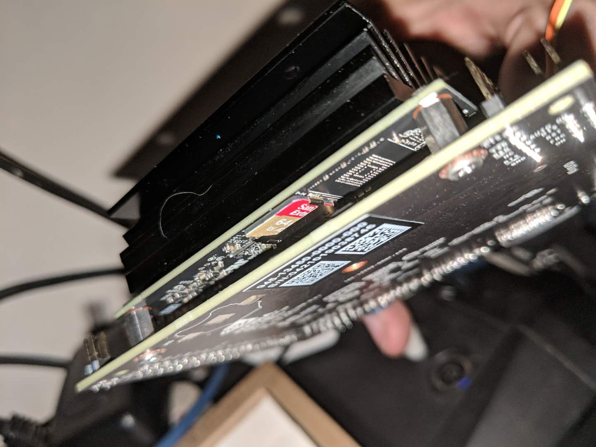
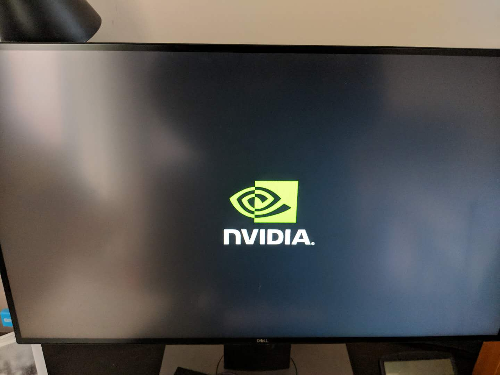
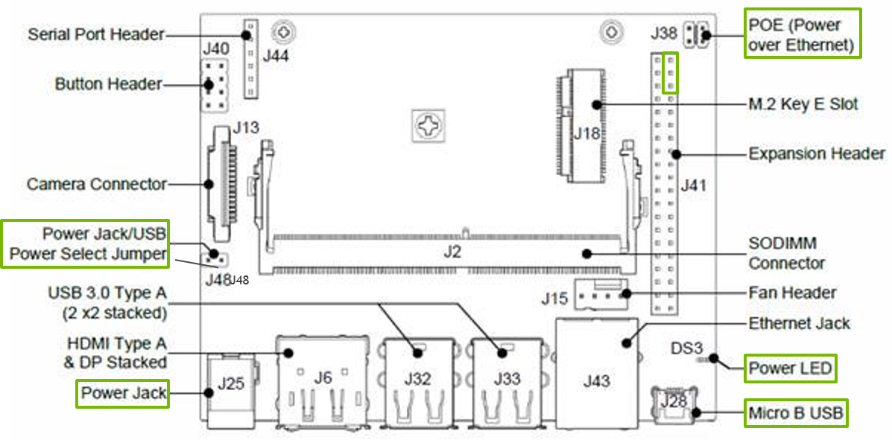
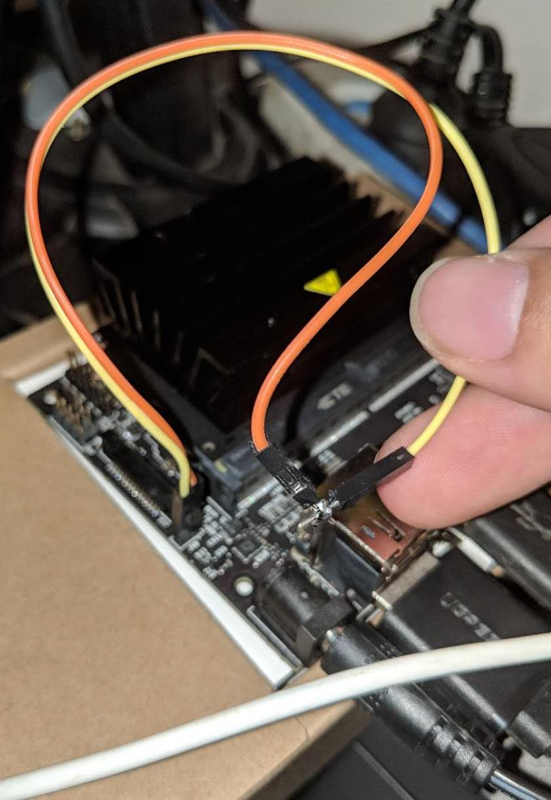
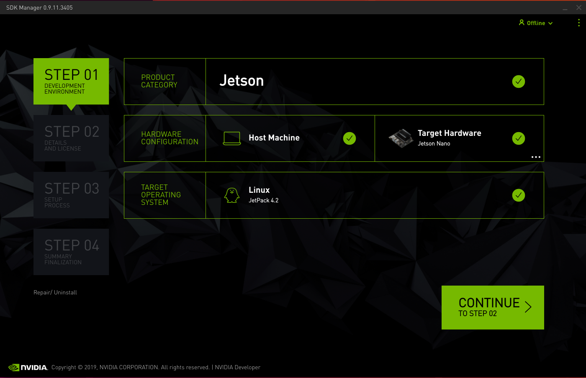
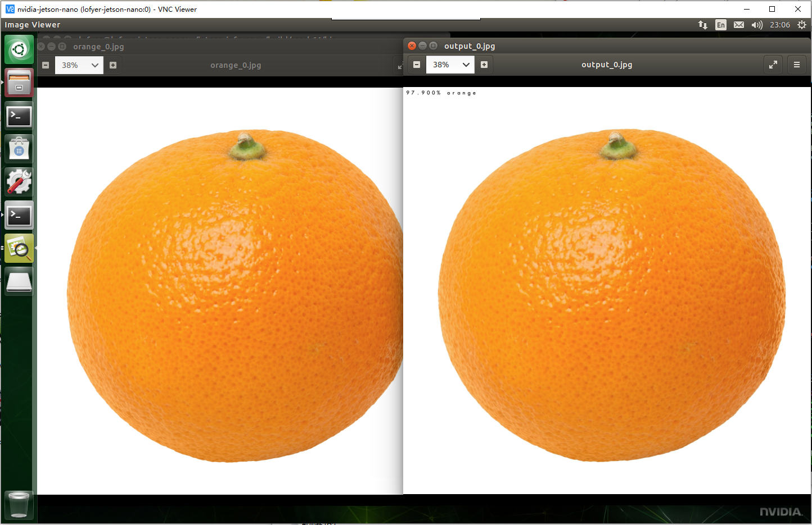

本文将以NVIDIA Jetson为硬件基础，为你展现NVIDIA的力量，可以将其作为Jetson Nano的入门参考手册（教程）。

# 1\. 入门篇

入门篇的有两章内容，来自NVIDIA JETSON包装盒自带的内容。

## 1.1. 准备环境

Ref.1: [https://developer.nvidia.com/embedded/learn/get-started-jetson-nano-devkit](https://developer.nvidia.com/embedded/learn/get-started-jetson-nano-devkit)

Ref.2: [https://developer.nvidia.com/embedded/downloads](https://developer.nvidia.com/embedded/downloads)

这里我使用的是一个Jetson Nano开发板，起初我以为随便一个USB数据线就能把它跑起来，但是我想多了。18W的快充头插上后可以正常启动，但是一旦运行比如WebGL测试的页面直接就关机了，因而我把小米音箱的电源适配器（5V2A）给它用了，还真能跑的动。

但是为了接下来的内容，我特意买了一个5V4A的5.5mm OD的电源适配器，要不然以我现在的环境很难保证能过了接下来的准备环境阶段。

要使用这个板子，你需要提前下载[SDK的SD卡镜像](https://developer.nvidia.com/embedded/dlc/jetson-nano-dev-kit-sd-card-image)，以及Host OS（PC，Ubuntu 18.04）所需的[SDK Manager](https://developer.nvidia.com/embedded/dlc/nv-sdk-manager)。

下载完成之后，从Ref.1的链接中下载所需的镜像烧录软件或者别的烧录软件也行，将SD卡镜像烧录至TF卡中（这里我使用的是64G TF卡，A2）。烧录完毕将其插入核心板下面的卡槽中（有些不好找），见下图。

然后通过HDMI/DP线将之与显示器连接（启动阶段的分辨率需要修改，要不然小点的屏幕没法显示启动logo，这个不是重点以后再说），插上蓝牙USB键鼠，接入USB电源，你就可以看到信仰之NVIDIA logo。

这里你需要等它初始化完成，初始化工作包括扩展跟文件系统、解压乱七八糟的包之类的，总之等看到Ubuntu Desktop的安装配置界面后可以开始操作了。

进入桌面后的第一件事儿，可以先打开Chromium，访问[WebGL的示例网站](https://webglsamples.org/)，随便开个demo试试会不会关机，如果关机那么恭喜你可以找个正经的USB电源了（Ref.1里有Adafruit的USB和DC电源适配器购买链接）。

当你的DC电源到了以后，先不要直接插上，因为需要设置一下跳线，如图所示。

看到Power Jack/USB Jumper没，由于我手里没有跳线帽，所以我直接短接了它们，如图所示（看我意念焊接术）。

然后再插上刚入手的DC 5V4A，即可空出你的USB并将之与Host PC相连了。

## 1.2. 准备SDK

**这一节你可以先跳过去，等跑完下面的小节后再看，因为这部分并不影响接下来的操作。**

准备SDK的内容主要包括：下载安装Host PC、开发板所需CUDA、OpenCV之类的，需要开发板的USB连接到Host PC上作数据连接用（我没有尝试过那个USB口既作电源又作数据传输）。

这里我并不打算过多介绍，只要按照引导进行操作即可。

## 1.3. Hello AI World

这个示例为你充分避开了各种依赖库的复杂安装步骤以及非常多的专业术语，对新手较为友好，但是我会仍会将其以链接形式展现，在最后章节的连接中。

第一步，从Hello World开始，你仍然需要最基础的工具。

$ sudo apt install git make cmake
$ git clone https://github.com/dusty-nv/jetson-inference
$ cd jetson-inference
$ git submodule update --init
$ mkdir build
$ cd build
$ cmake ../
$ make -j4
$ sudo make install
$ cd aarch64/bin

这一顿操作后，你会拥有个Hello AI World的全部成果。但是，what the hell an I doing?

来，对于一些Linux不熟悉的同学来说只要知道这里的cmake与make是编译源码的指令就行，cmake用来生成Makefile，make会根据Makefile里定义的动作调用gcc开始编译。

然后让我们看第一个例子，使用[ImageNet](http://www.image-net.org/)的图片素材来训练我们的“机器人”让它能够识别各种物体，其中你会看到当前目录下有两个imagenet开头的文件，让我们从imagenet-console开始。

在图形界面上打开终端后，执行如下命令。

$ ./imagenet-console orange\_0.jpg output\_0.jpg
$ nautilus .

然后经过机器人的推理以后，你会得到一张橘子、另一张还是橘子的图片，并且新橘子图片的左上角标识了机器人认为它有多大概率是橘子。

是不是有感觉了？OK，我们继续。

既然它可以看图片，那么它当然也可以看视频或者摄像头中的内容，那么接下来我们让它看到摄像头中的橘子试试。

这里我需要给Jetson Nano接一个USB摄像头，接入以后可以在终端键入cheese打开拍照应用程序看它是否工作。

然后终端中运行如下命令。

./imagenet-camera

Oops，segmentation fault了，[如文档所说](https://github.com/dusty-nv/jetson-inference/blob/master/docs/imagenet-camera-2.md)，默认的摄像头是板载CSI摄像头，所以这里需要修改代码让它使用后来插入的USB摄像头。

$ vi ../../../imagenet-camera/imagenet-camera.cpp

...
#include "imageNet.h"
#define DEFAULT\_CAMERA 0 // -1 for onboard camera, or change to index of /dev/video V4L2 camera (>=0)
bool signal\_recieved = false;
...

将DEFAULT\_CAMERA修改为0以后，便会启用/dev/video0路径上的摄像头，然后重新编译。

$ cd ../../ # build
$ cmake ../
$ make -j4

然后进到bin目录下再运行一次imagenet-camera即可。

**PS：不是所有的摄像头都叫罗技C920，由于摄像头原生编码的问题，可能会导致上述程序黑屏，那么我们需要是适当修改一些内容。笔者暂时跳过这里，等改好以后再看。关于兼容列表可以参考[eLinux的链接](https://elinux.org/Jetson_Nano#Ecosystem_Products_and_Sensors)。**

## 1.4. 写一个小程序

如果你跟着github的教程，那么应该到你自己写一段代码的时间了，直接粘贴吧。

// include imageNet header for image recognition
#include <jetson-inference/imageNet.h>
// // include loadImage header for loading images
#include <jetson-utils/loadImage.h>

int main( int argc, char\*\* argv )
{
                // a command line argument containing the image filename is expected,
                //      // so make sure we have at least 2 args (the first arg is the program)
  if( argc < 2 )
  {
    printf("my-recognition:  expected image filename as argument\\n");
    printf("example usage:   ./my-recognition my\_image.jpg\\n");
    return 0;
  }

// retrieve the image filename from the array of command line args
  const char\* imgFilename = argv\[1\];
  float\* imgCPU    = NULL;    // CPU pointer to floating-point RGBA image data
  float\* imgCUDA   = NULL;    // GPU pointer to floating-point RGBA image data
  int    imgWidth  = 0;       // width of the image (in pixels)
  int    imgHeight = 0;       // height of the image (in pixels)

// load the image from disk as float4 RGBA (32 bits per channel, 128 bits per pixel)
  if( !loadImageRGBA(imgFilename, (float4\*\*)&imgCPU, (float4\*\*)&imgCUDA, &imgWidth, &imgHeight) )
  {
    printf("failed to load image '%s'\\n", imgFilename);
    return 0;
  }
  imageNet\* net = imageNet::Create(imageNet::GOOGLENET);

  if( !net )
  {
    printf("failed to load image recognition network\\n");
    return 0;
  }
  float confidence = 0.0;
  const int classIndex = net->Classify(imgCUDA, imgWidth, imgHeight, &confidence);
  if( classIndex >= 0 )
  {
    // retrieve the name/description of the object class index
    const char\* classDescription = net->GetClassDesc(classIndex);
    // print out the classification results
    printf("image is recognized as '%s' (class #%i) with %f%% confidence\\n",
    classDescription, classIndex, confidence \* 100.0f);
  }
  else
  {
    // if Classify() returned < 0, an error occurred
    printf("failed to classify image\\n");
  }
  delete net;
  // this is the end of the example!
  return 0;
}

\# require CMake 2.8 or greater
cmake\_minimum\_required(VERSION 2.8)

# declare my-recognition project
project(my-recognition)

# import jetson-inference and jetson-utils packages.
# note that if you didn't do "sudo make install"
# while building jetson-inference, this will error.
find\_package(jetson-utils)
find\_package(jetson-inference)

# CUDA and Qt4 are required
find\_package(CUDA)
find\_package(Qt4)

# setup Qt4 for build
include(${QT\_USE\_FILE})
add\_definitions(${QT\_DEFINITIONS})

# compile the my-recognition program
cuda\_add\_executable(my-recognition my-recognition.cpp)

# link my-recognition to jetson-inference library
target\_link\_libraries(my-recognition jetson-inference)

然后编译并运行。

$ cmake .
$ make
$ ./my.cpp polarbear.jpg

输出结果如下。

\[cuda\]  cudaAllocMapped 5089520 bytes, CPU 0x100c30000 GPU 0x100c30000

imageNet -- loading classification network model from:
         -- prototxt     networks/googlenet.prototxt
         -- model        networks/bvlc\_googlenet.caffemodel
         -- class\_labels networks/ilsvrc12\_synset\_words.txt
         -- input\_blob   'data'
         -- output\_blob  'prob'
         -- batch\_size   2

\[TRT\]  TensorRT version 5.0.6
\[TRT\]  detected model format - caffe  (extension '.caffemodel')
\[TRT\]  desired precision specified for GPU: FASTEST
\[TRT\]  requested fasted precision for device GPU without providing valid calibrator, disabling INT8
\[TRT\]  native precisions detected for GPU:  FP32, FP16
\[TRT\]  selecting fastest native precision for GPU:  FP16
\[TRT\]  attempting to open engine cache file /usr/local/bin/networks/bvlc\_googlenet.caffemodel.2.1.GPU.FP16.engine
\[TRT\]  loading network profile from engine cache... /usr/local/bin/networks/bvlc\_googlenet.caffemodel.2.1.GPU.FP16.engine
\[TRT\]  device GPU, /usr/local/bin/networks/bvlc\_googlenet.caffemodel loaded
\[TRT\]  device GPU, CUDA engine context initialized with 2 bindings
\[TRT\]  binding -- index   0
               -- name    'data'
               -- type    FP32
               -- in/out  INPUT
               -- # dims  3
               -- dim #0  3 (CHANNEL)
               -- dim #1  224 (SPATIAL)
               -- dim #2  224 (SPATIAL)
\[TRT\]  binding -- index   1
               -- name    'prob'
               -- type    FP32
               -- in/out  OUTPUT
               -- # dims  3
               -- dim #0  1000 (CHANNEL)
               -- dim #1  1 (SPATIAL)
               -- dim #2  1 (SPATIAL)
\[TRT\]  binding to input 0 data  binding index:  0
\[TRT\]  binding to input 0 data  dims (b=2 c=3 h=224 w=224) size=1204224
\[cuda\]  cudaAllocMapped 1204224 bytes, CPU 0x101310000 GPU 0x101310000
\[TRT\]  binding to output 0 prob  binding index:  1
\[TRT\]  binding to output 0 prob  dims (b=2 c=1000 h=1 w=1) size=8000
\[cuda\]  cudaAllocMapped 8000 bytes, CPU 0x101440000 GPU 0x101440000
device GPU, /usr/local/bin/networks/bvlc\_googlenet.caffemodel initialized.
\[TRT\]  networks/bvlc\_googlenet.caffemodel loaded
imageNet -- loaded 1000 class info entries
networks/bvlc\_googlenet.caffemodel initialized.
class 0296 - 1.000000  (ice bear, polar bear, Ursus Maritimus, Thalarctos maritimus)
image is recognized as 'ice bear, polar bear, Ursus Maritimus, Thalarctos maritimus' (class #296) with 100.000000% confidence

简言之，程序使用ImageNet的图片配上GoogleNet的模型对你的图片进行推理，然后得出它认为这是北极熊的可能性。

因为这篇文章的目的是入门，也就是带进来以后看哪个方向就自己看，所以相关数学知识在这里已经忽略了，如果你能写出厉害的理论paper又做出很厉害的工程实现，那么大牛就请继续往下过，顺便留个言交个朋友让我膜拜一下。你也可以查看文末的链接进一步扩展阅读什么是GoogleNet，什么是CNN，然后撸一遍机器学习、深度学习、强化学习啥的，也可能一路懵懂复习到信号与系统、高等数学，你要书的话我这还卖，另外我的学习笔记可以参阅[DataNote](https://datanote.readthedocs.io/zh/master/)。

# 2\. 进阶篇

## 2.1. 重新训练模型

## 2.2. 作为推理节点

## 2.3. 深度学习实验

## 2.4. TensorFlow实验

安装TensorFlow

$ sudo apt-get install libhdf5-serial-dev hdf5-tools libhdf5-dev zlib1g-dev zip libjpeg8-dev
$ sudo apt-get install python3-pip
$ sudo pip3 install -U pip
$ sudo pip3 install -U numpy grpcio absl-py py-cpuinfo psutil portpicker six mock requests gast h5py astor termcolor protobuf keras-applications keras-preprocessing wrapt google-pasta
$ sudo pip3 install --pre --extra-index-url https://developer.download.nvidia.com/compute/redist/jp/v42 tensorflow-gpu==1.14.0+nv19.9

https://devtalk.nvidia.com/default/topic/1048776/official-tensorflow-for-jetson-nano-/

https://www.tensorflow.org/tutorials

with jupyter

## 2.5. TensorRT实验

# 3\. 行业方案篇

太阳底下没有新东西，我发现把之前的笔记稍微整理点可以新开一个目录出一个系列，那么，这里我就直接写关键字吧，以后说不定又冒出什么新东西了呢。

在继续之前，我们需要抓住一样内容，即凡是人类自己通过观察、模仿、学习可以获得的重复能力，机器/深度/强化等内容理论来说都可以帮你实现，即使是创造力。

然后我们再讲方案，即在这个小小的盒子，它有多少能力，能干啥。

## 3.1. 边缘计算

工业现场

计算转移

CDN

军用头戴

## 3.2. 云游戏

4K/8K/HDR/60FPS家用主机、服务端

无主机头戴

## 3.3. 教学设备

甭管便宜的贵的只要带卡都能当教学设备，不信你看研究生论文有多少CUDA相关。

## 3.4. 残障辅助

手语翻译（[https://github.com/EvilPort2/Sign-Language](https://github.com/EvilPort2/Sign-Language)），可按照中国残联手语进行训练（[http://www.cdpf.org.cn/special/zgsy/node\_305701.htm](http://www.cdpf.org.cn/special/zgsy/node_305701.htm)）。

apt install python3-keras

辅助视觉（物体/人脸识别后转语音）

# 参考：

## 文献

\[1\] NVIDIA AI Two Days Demo: [https://developer.nvidia.com/embedded/twodaystoademo](https://developer.nvidia.com/embedded/twodaystoademo)

\[2\] CNN Architecture: [https://medium.com/@sidereal/cnns-architectures-lenet-alexnet-vgg-googlenet-resnet-and-more-666091488df5](https://medium.com/@sidereal/cnns-architectures-lenet-alexnet-vgg-googlenet-resnet-and-more-666091488df5)

\[3\] eLinux: [https://www.elinux.org/Jetson](https://www.elinux.org/Jetson)

## 术语

\[1\] ImageNet: [http://image-net.org/download](http://image-net.org/download)

\[2\] TensorRT: [https://developer.nvidia.com/tensorrt](https://developer.nvidia.com/tensorrt)

\[3\] DeepStream: [https://developer.nvidia.com/deepstream-sdk](https://developer.nvidia.com/deepstream-sdk)

\[4\] cuDNN

\[5\] PyTorch

\[6\] NVDLA
