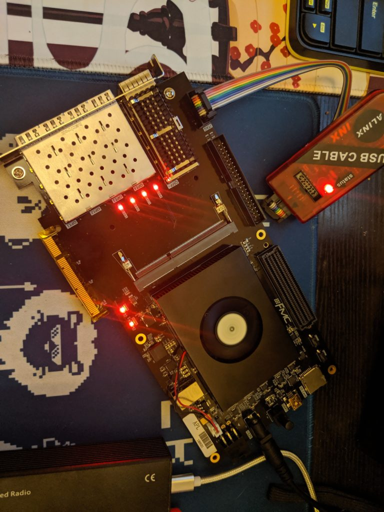

# 0\. Background

As we all know, P4 is about to be the future of OpenFlow 2.0, and to achieve an totally software defined network with programmable control plane and data plane.

# 1\. Basic Knowledge

Since we've got P4 working on X86 server

In SDN controller ONOS.

 

# 2\. Software/Hardware Plant

## 2.1. Pureway: P4 bitstream

## 2.2. Easyway: P4 on PetaLinux

# 3\. Further Exploration
